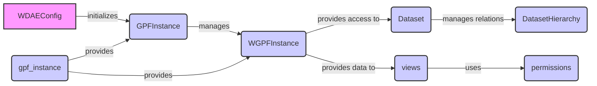

### Component Descriptions:

**WDAEConfig:**
*   **Purpose:** Initializes the GPFInstance and WGPFInstance during the Django app startup.
*   **Functionality:** Overrides the `ready` method to trigger the initialization process.
*   **Relations:** Initializes `GPFInstance`.
*   **Source Files:** `repos/gpf/wdae/wdae/gpf_instance/apps.py`

**GPFInstance:**
*   **Purpose:** Manages genotype data, phenotype data, and configurations.
*   **Functionality:** Provides access to data-related functionalities like loading data, retrieving phenotype data, genotype data, transcript models, phenotype data IDs, and phenotype data configurations.
*   **Relations:** Managed by `WDAEConfig`, provides data to `WGPFInstance` and accessed by `gpf_instance` module.
*   **Source Files:** `dae/gpf_instance/gpf_instance.py`

**WGPFInstance:**
*   **Purpose:** Wraps GPFInstance and provides WDAE-specific functionalities and configurations.
*   **Functionality:** Manages study wrappers, prepares GP configurations, and provides access to available data IDs and WDAE GP configurations.
*   **Relations:** Wraps `GPFInstance`, provides data to `views`, and accessed by `gpf_instance` module.
*   **Source Files:** `gpf_instance/gpf_instance.py`

**Dataset:**
*   **Purpose:** Manages dataset metadata, broken status, and group permissions.
*   **Functionality:** Provides methods to recreate permissions, set broken status, and update dataset names.
*   **Relations:** Provides data to `views` and manages relations with `DatasetHierarchy`.
*   **Source Files:** `datasets_api/models.py`

**DatasetHierarchy:**
*   **Purpose:** Manages hierarchical relationships between datasets.
*   **Functionality:** Provides methods to clear existing relations and add new parent-child relations between datasets.
*   **Relations:** Managed by `Dataset`.
*   **Source Files:** `datasets_api/models.py`

**views:**
*   **Purpose:** Handles API requests related to datasets, gene profiles, pheno tools, and families.
*   **Functionality:** Defines endpoints for accessing and manipulating data.
*   **Relations:** Receives data from `WGPFInstance` and uses `permissions`.
*   **Source Files:** `repos/gpf/wdae/wdae/datasets_api/views.py`, `repos/gpf/wdae/wdae/gene_profiles_api/views.py`, `repos/gpf/wdae/wdae/pheno_tool_api/views.py`, `repos/gpf/wdae/wdae/family_api/views.py`, `repos/gpf/wdae/wdae/gpf_instance/views.py`

**permissions:**
*   **Purpose:** Manages dataset permissions and access control.
*   **Functionality:** Defines custom permissions to check if a user is allowed to access a specific dataset.
*   **Relations:** Used by `views`.
*   **Source Files:** `repos/gpf/wdae/wdae/datasets_api/permissions.py`

**gpf_instance:**
*   **Purpose:** Module containing functions for managing and accessing GPFInstance and WGPFInstance.
*   **Functionality:** Provides functions to get the WGPFInstance, reload datasets, and manage cacheable hashes.
*   **Relations:** Provides access to `GPFInstance` and `WGPFInstance`.
*   **Source Files:** `gpf_instance/gpf_instance.py`, `repos/gpf/wdae/wdae/gpf_instance/gpf_instance.py`
