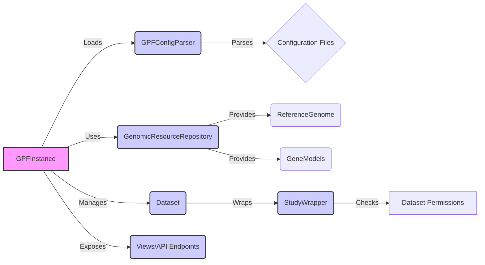

## Component Descriptions:

**GPFInstance**
- *Description*: The central component that manages the GPF instance, loading configurations, and providing access to genomic resources and genotype data. It acts as a central registry and access point for other components.
- *Functionality*: Loads configurations using `GPFConfigParser`, manages access to genomic resources via `GenomicResourceRepository`, and provides access to datasets and studies. It also exposes functionalities through API endpoints.
- *Interactions*: Loads configurations from `GPFConfigParser`, uses `GenomicResourceRepository` to access genomic resources, manages `Dataset` and `StudyWrapper`, and exposes data through `Views/API Endpoints`.
- *Relevant source files*: `dae.gpf_instance.gpf_instance.GPFInstance`, `gpf_instance.gpf_instance.GPFInstance`

**GPFConfigParser**
- *Description*: Parses and interpolates GPF configuration files, loading settings for various components like genomic resources, datasets, and studies. It transforms configuration files into usable data structures.
- *Functionality*: Reads configuration files (YAML, TOML), interpolates variables, and transforms them into usable data structures.
- *Interactions*: Parses `Configuration Files` and provides the parsed configuration to `GPFInstance`.
- *Relevant source files*: `dae.configuration.gpf_config_parser.GPFConfigParser`

**Configuration Files**
- *Description*: YAML or TOML files containing configuration settings for the GPF instance, genomic resources, datasets, and studies.
- *Functionality*: Stores configuration settings.
- *Interactions*: Parsed by `GPFConfigParser`.

**GenomicResourceRepository**
- *Description*: Manages genomic resources, providing access to reference genomes, gene models, and other genomic data. It abstracts the storage and retrieval of genomic resources.
- *Functionality*: Provides access to genomic resources like `ReferenceGenome` and `GeneModels`.
- *Interactions*: Used by `GPFInstance` to access genomic resources; provides `ReferenceGenome` and `GeneModels`.
- *Relevant source files*: `dae.genomic_resources.repository_factory.build_genomic_resource_repository`, `dae.genomic_resources.group_repository.GenomicResourceGroupRepo`

**ReferenceGenome**
- *Description*: Represents a reference genome, providing access to sequence data. It enables sequence retrieval for genomic coordinates.
- *Functionality*: Provides sequence data for genomic coordinates.
- *Interactions*: Accessed by `GenomicResourceRepository`.
- *Relevant source files*: `dae.genomic_resources.reference_genome.build_reference_genome_from_resource`, `dae.genomic_resources.reference_genome.ReferenceGenome.open`, `dae.genomic_resources.reference_genome.ReferenceGenome`

**GeneModels**
- *Description*: Represents gene models, providing information about transcripts, exons, and CDS regions. It allows querying gene structures for annotation and analysis.
- *Functionality*: Provides gene structure information.
- *Interactions*: Accessed by `GenomicResourceRepository`.
- *Relevant source files*: `dae.genomic_resources.gene_models.gene_models.build_gene_models_from_resource`, `dae.genomic_resources.gene_models.gene_models.GeneModels.load`, `dae.genomic_resources.gene_models.gene_models.GeneModels`

**Dataset**
- *Description*: Represents a dataset in the system, handling permissions and metadata. It provides a unified interface for accessing study data.
- *Functionality*: Manages dataset metadata and permissions.
- *Interactions*: Managed by `GPFInstance`; wraps `StudyWrapper`.
- *Relevant source files*: `datasets_api.models.Dataset`, `datasets_api.models.DatasetHierarchy`

**StudyWrapper**
- *Description*: Wraps a study, providing a unified interface for accessing study data. It encapsulates the study's data and metadata.
- *Functionality*: Provides a unified interface for accessing study data.
- *Interactions*: Wraps a study and is checked for permissions by `Dataset Permissions`.
- *Relevant source files*: `studies.study_wrapper.StudyWrapper`, `studies.study_wrapper.WDAEStudy`

**Dataset Permissions**
- *Description*: Handles dataset permissions and access control. It determines which users have access to which datasets.
- *Functionality*: Checks user permissions for datasets.
- *Interactions*: Checked by `StudyWrapper`.
- *Relevant source files*: `datasets_api.permissions.IsDatasetAllowed`, `datasets_api.permissions.get_dataset_info`, `datasets_api.permissions.user_has_permission`

**Views/API Endpoints**
- *Description*: Defines API endpoints for accessing data and functionalities, including dataset descriptions, gene models, and pheno tools. It exposes the system's functionalities through a web API.
- *Functionality*: Exposes data and functionalities through a web API.
- *Interactions*: Exposed by `GPFInstance`.
- *Relevant source files*: `repos.gpf.wdae.wdae.datasets_api.views`, `repos.gpf.wdae.wdae.genomes_api.views`, `repos.gpf.wdae.wdae.pheno_tool_api.views`, `repos.gpf.wdae.wdae.gene_view.views`