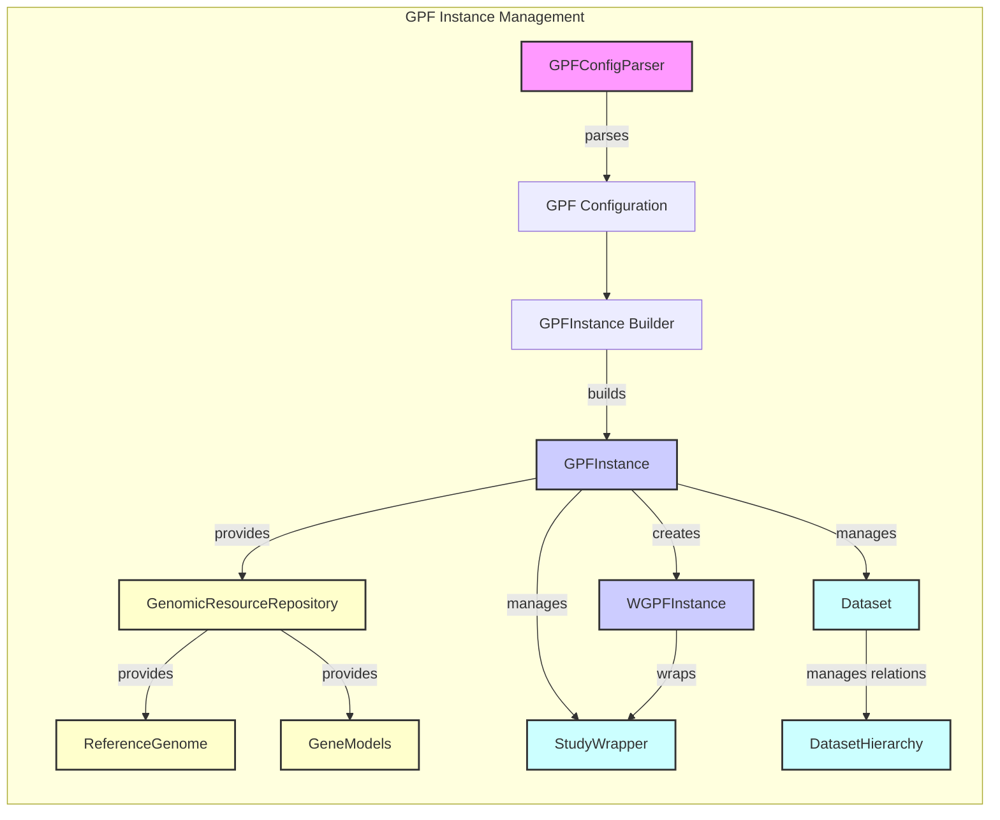

### Component Descriptions:

**GPFConfigParser**:
Parses and interpolates GPF configuration files from YAML or TOML formats. It provides the configuration to the GPFInstance builder.
*Relevant source file*: `dae.configuration.gpf_config_parser`

**GPF Configuration**:
Represents the configuration data parsed by the GPFConfigParser. It is used by the GPFInstance builder to configure the GPFInstance.
*Relevant source file*: `dae.configuration.gpf_config_parser`

**GPFInstanceBuilder**:
Responsible for building the GPFInstance based on the parsed configuration. It orchestrates the creation and loading of genomic resources and datasets.
*Relevant source file*: `dae.gpf_instance.gpf_instance`

**GPFInstance**:
Represents the core GPF instance, providing access to genomic resources, datasets, and configurations. It manages the lifecycle of datasets and genomic resources.
*Relevant source file*: `dae.gpf_instance.gpf_instance`

**GenomicResourceRepository**:
Manages genomic resources like reference genomes and gene models. It provides access to these resources to the GPFInstance.
*Relevant source file*: `dae.genomic_resources.repository_factory`

**ReferenceGenome**:
Represents a reference genome, allowing access to sequence data. It is built from genomic resources and used by the GPFInstance.
*Relevant source file*: `dae.genomic_resources.reference_genome`

**GeneModels**:
Represents gene models, providing information about gene structures and transcripts. It is built from genomic resources and used by the GPFInstance.
*Relevant source file*: `dae.genomic_resources.gene_models.gene_models`

**Dataset**:
Represents a dataset in the system, managing permissions and state. It is managed by the GPFInstance and interacts with the DatasetHierarchy.
*Relevant source file*: `datasets_api.models`

**StudyWrapper**:
Wraps a study and provides WDAE specific functionalities. It is managed by the GPFInstance and wrapped by the WGPFInstance.
*Relevant source file*: `studies.study_wrapper`

**WGPFInstance**:
Extends GPFInstance to provide WDAE specific functionalities. It wraps studies and provides methods to access and manage datasets within the WDAE environment.
*Relevant source file*: `dae.gpf_instance.gpf_instance`

**DatasetHierarchy**:
Manages the hierarchy and relations between datasets. It is used by the Dataset to manage dataset relations.
*Relevant source file*: `datasets_api.models`