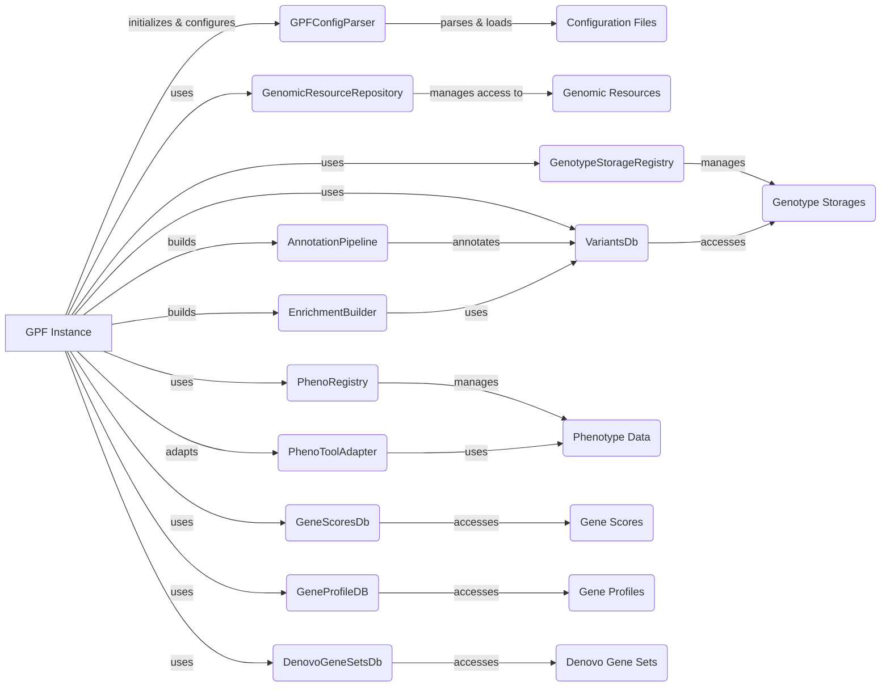

```mermaid
graph LR
    A[GPF Instance] -- initializes & configures --> B(GPFConfigParser)
    B -- parses & loads --> C(Configuration Files)
    A -- uses --> D(GenomicResourceRepository)
    D -- manages access to --> E(Genomic Resources)
    A -- uses --> F(GenotypeStorageRegistry)
    F -- manages --> G(Genotype Storages)
    A -- uses --> H(VariantsDb)
    H -- accesses --> G
    A -- uses --> I(PhenoRegistry)
    I -- manages --> J(Phenotype Data)
    A -- uses --> K(GeneScoresDb)
    K -- accesses --> L(Gene Scores)
    A -- uses --> M(GeneProfileDB)
    M -- accesses --> N(Gene Profiles)
    A -- uses --> O(DenovoGeneSetsDb)
    O -- accesses --> P(Denovo Gene Sets)
    A -- builds --> Q(AnnotationPipeline)
    Q -- annotates --> H
    A -- builds --> R(EnrichmentBuilder)
    R -- uses --> H
    A -- adapts --> S(PhenoToolAdapter)
    S -- uses --> J
```
