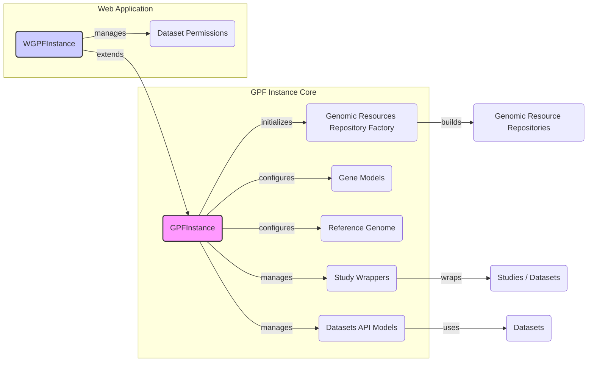

### Component Descriptions:

*   **GPFInstance (Base)**:
    *   *Purpose*: The core GPF instance, providing access to genomic resources, datasets, and managing the overall application context.
    *   *Functionality*: Initializes and configures genomic resources, study wrappers, and datasets API. It acts as a central point for accessing various GPF components.
    *   *Relations*: Initializes `Genomic Resources Repository Factory`, configures `Gene Models` and `Reference Genome`, manages `Study Wrappers` and `Datasets API`.
    *   *Relevant source files*: `dae/gpf_instance/gpf_instance.py`

*   **WGPFInstance**:
    *   *Purpose*: Extends `GPFInstance` for web applications, managing study wrappers, configurations, and dataset permissions.
    *   *Functionality*: Inherits core functionalities from `GPFInstance` and adds web-specific features like dataset permissions management.
    *   *Relations*: Extends `GPFInstance` and manages `Dataset Permissions`.
    *   *Relevant source files*: `dae/gpf_instance/gpf_instance.py`

*   **Genomic Resources Repository Factory**:
    *   *Purpose*: Creates and configures genomic resource repositories.
    *   *Functionality*: Builds genomic resource repositories from configuration.
    *   *Relations*: Initialized by `GPFInstance` and builds `Genomic Resource Repositories`.
    *   *Relevant source files*: `dae/genomic_resources/repository_factory.py`

*   **Genomic Resource Repositories**:
    *   *Purpose*: Manages access to genomic resources like reference genomes and gene models.
    *   *Functionality*: Provides access to genomic resources stored in various repositories.
    *   *Relations*: Built by `Genomic Resources Repository Factory`.
    *   *Relevant source files*: `dae/genomic_resources/group_repository.py`

*   **Gene Models**:
    *   *Purpose*: Provides access to gene models.
    *   *Functionality*: Loads and manages gene models from genomic resources.
    *   *Relations*: Configured by `GPFInstance`.
    *   *Relevant source files*: `dae/genomic_resources/gene_models/gene_models.py`

*   **Reference Genome**:
    *   *Purpose*: Provides access to the reference genome.
    *   *Functionality*: Loads and manages the reference genome from genomic resources.
    *   *Relations*: Configured by `GPFInstance`.
    *   *Relevant source files*: `dae/genomic_resources/reference_genome/reference_genome.py`

*   **Study Wrappers**:
    *   *Purpose*: Wraps studies and datasets, providing a consistent interface for accessing data and metadata.
    *   *Functionality*: Provides a unified way to access study data and metadata.
    *   *Relations*: Managed by `GPFInstance` and wraps `Studies / Datasets`.
    *   *Relevant source files*: `studies/study_wrapper.py`

*   **Studies / Datasets**:
    *   *Purpose*: Represents the actual studies and datasets.
    *   *Functionality*: Contains the data and metadata for studies and datasets.
    *   *Relations*: Wrapped by `Study Wrappers`.
    *   *Relevant source files*: Various study-specific files.

*   **Datasets API Models**:
    *   *Purpose*: Models for managing datasets and their hierarchy.
    *   *Functionality*: Provides models for representing datasets and their relationships.
    *   *Relations*: Managed by `GPFInstance` and uses `Datasets`.
    *   *Relevant source files*: `datasets_api/models.py`

*   **Datasets**:
    *   *Purpose*: Represents datasets and their hierarchy.
    *   *Functionality*: Stores information about datasets and their hierarchical structure.
    *   *Relations*: Used by `Datasets API Models`.
    *   *Relevant source files*: Various dataset-specific files.

*   **Dataset Permissions**:
    *   *Purpose*: Manages permissions for datasets in web applications.
    *   *Functionality*: Controls access to datasets based on user roles and permissions.
    *   *Relations*: Managed by `WGPFInstance`.
    *   *Relevant source files*: `datasets_api/permissions.py` (example)
