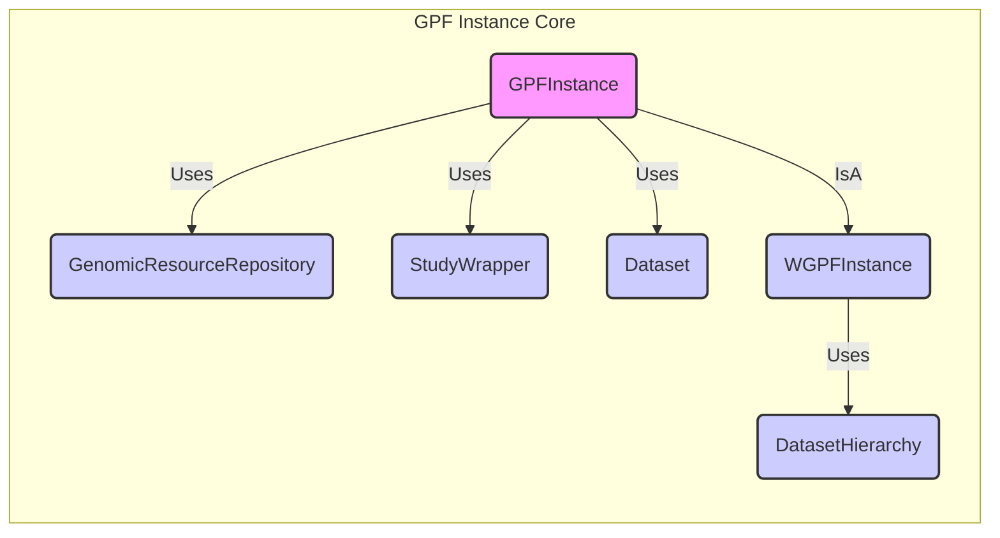

### Component Descriptions:

- **GPFInstance**
   - *Description*: Represents the core GPF instance, providing access to the various GPF components and managing the overall configuration. It acts as a central point for accessing and coordinating different functionalities.
   - *Interactions*: Uses `GenomicResourceRepository` to access genomic resources, `StudyWrapper` to wrap studies, and `Dataset` to represent datasets.
   - *Source Files*: `dae.gpf_instance.gpf_instance.GPFInstance`

- **WGPFInstance**
   - *Description*: Extends GPFInstance to provide web-specific functionalities, such as managing dataset permissions and caching.
   - *Interactions*: Inherits from `GPFInstance` and uses `DatasetHierarchy` to manage hierarchical relationships between datasets.
   - *Source Files*: `dae.gpf_instance.gpf_instance.WGPFInstance`

- **GenomicResourceRepository**
   - *Description*: Manages access to genomic resources like reference genomes and gene models.
   - *Interactions*: Used by `GPFInstance` to retrieve genomic resources.
   - *Source Files*: `dae.genomic_resources.repository_factory.build_genomic_resource_repository`

- **StudyWrapper**
   - *Description*: Wraps a study, providing a consistent interface for accessing study data. It transforms and queries variants.
   - *Interactions*: Used by `GPFInstance` to access study data.
   - *Source Files*: `studies.study_wrapper.StudyWrapper`

- **Dataset**
   - *Description*: Represents a dataset and its associated permissions. It manages dataset permissions and broken status.
   - *Interactions*: Used by `GPFInstance` to represent datasets and their permissions.
   - *Source Files*: `datasets_api.models.Dataset`

- **DatasetHierarchy**
   - *Description*: Manages the hierarchical relationships between datasets. It stores and retrieves parent-child relationships between datasets.
   - *Interactions*: Used by `WGPFInstance` to manage dataset hierarchies.
   - *Source Files*: `datasets_api.models.DatasetHierarchy`