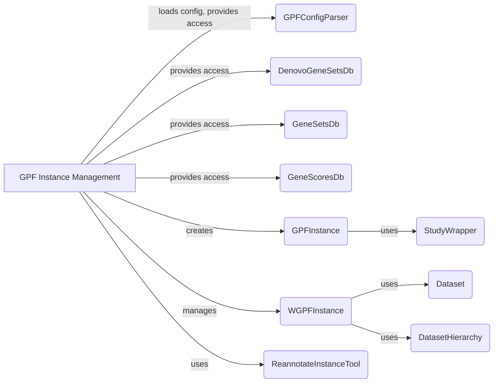

**Component Descriptions:**

*   **GPF Instance Management:** Manages the GPFInstance, including configuration loading, timestamp management, and cacheable hash handling. It serves as a central access point for various data and functionalities within the project. It loads configurations using `GPFConfigParser` and provides access to various databases like `DenovoGeneSetsDb`, `GeneSetsDb`, and `GeneScoresDb`. It creates and manages `GPFInstance` and `WGPFInstance`.
    *   Relevant source files: `dae/gpf_instance/gpf_instance.py`

*   **GPFConfigParser:** Parses and interpolates GPF configuration files. It loads and processes configuration files, making the configuration available to other components, especially `GPF Instance Management`. 
    *   Relevant source files: `dae/configuration/gpf_config_parser.py`

*   **DenovoGeneSetsDb:** Provides access to denovo gene sets. It serves as a data access layer for retrieving denovo gene sets, used by `GPF Instance Management` to provide access to these gene sets.
    *   Relevant source files: `dae/gene_sets/denovo_gene_sets_db.py`

*   **GeneSetsDb:** Provides access to gene sets. It serves as a data access layer for retrieving gene sets, used by `GPF Instance Management` to provide access to these gene sets.
    *   Relevant source files: `dae/gene_sets/gene_sets_db.py`

*   **GeneScoresDb:** Provides access to gene scores. It serves as a data access layer for retrieving gene scores, used by `GPF Instance Management` to provide access to these gene scores.
    *   Relevant source files: `dae/gene_scores/gene_scores.py`

*   **GPFInstance:** Represents a GPF instance, providing access to datasets, configurations, and resources. Created and managed by `GPF Instance Management`, it uses `StudyWrapper` to access study data.
    *   Relevant source files: `dae/gpf_instance/gpf_instance.py`

*   **StudyWrapper:** Wraps a study (dataset) to provide a consistent interface for accessing variant data and metadata. Used by `GPFInstance` to provide a consistent way to access study data.
    *   Relevant source files: `dae/studies/study_wrapper.py`

*   **WGPFInstance:** Represents a web-based GPF instance, extending GPFInstance with web-specific functionalities. Managed by `GPF Instance Management`, it uses `Dataset` and `DatasetHierarchy` for dataset management.
    *   Relevant source files: `dae/gpf_instance/gpf_instance.py`

*   **Dataset:** Represents a dataset in the system. Used by `WGPFInstance` for dataset-related operations.
    *   Relevant source files: `dae/datasets_api/models.py`

*   **DatasetHierarchy:** Represents the hierarchy of datasets. Used by `WGPFInstance` to manage relationships between datasets.
    *   Relevant source files: `dae/datasets_api/models.py`

*   **ReannotateInstanceTool:** Tool for reannotating a GPF instance. Used by `GPF Instance Management` to reannotate the instance.
    *   Relevant source files: `dae/annotation/reannotate_instance.py`