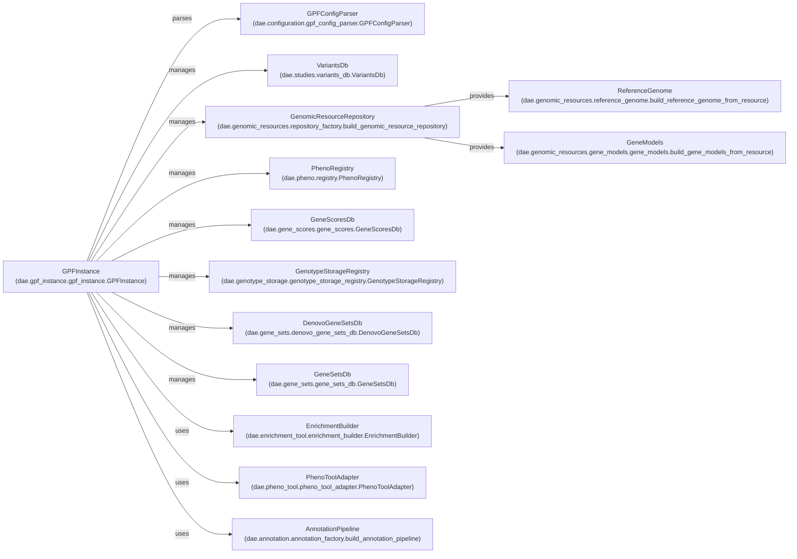

```mermaid
graph LR
    GPFInstance["GPFInstance\n(dae.gpf_instance.gpf_instance.GPFInstance)"]
    GPFConfigParser["GPFConfigParser\n(dae.configuration.gpf_config_parser.GPFConfigParser)"]
    VariantsDb["VariantsDb\n(dae.studies.variants_db.VariantsDb)"]
    GenomicResourceRepository["GenomicResourceRepository\n(dae.genomic_resources.repository_factory.build_genomic_resource_repository)"]
    ReferenceGenome["ReferenceGenome\n(dae.genomic_resources.reference_genome.build_reference_genome_from_resource)"]
    GeneModels["GeneModels\n(dae.genomic_resources.gene_models.gene_models.build_gene_models_from_resource)"]
    PhenoRegistry["PhenoRegistry\n(dae.pheno.registry.PhenoRegistry)"]
    GeneScoresDb["GeneScoresDb\n(dae.gene_scores.gene_scores.GeneScoresDb)"]
    GenotypeStorageRegistry["GenotypeStorageRegistry\n(dae.genotype_storage.genotype_storage_registry.GenotypeStorageRegistry)"]
    DenovoGeneSetsDb["DenovoGeneSetsDb\n(dae.gene_sets.denovo_gene_sets_db.DenovoGeneSetsDb)"]
    GeneSetsDb["GeneSetsDb\n(dae.gene_sets.gene_sets_db.GeneSetsDb)"]
    EnrichmentBuilder["EnrichmentBuilder\n(dae.enrichment_tool.enrichment_builder.EnrichmentBuilder)"]
    PhenoToolAdapter["PhenoToolAdapter\n(dae.pheno_tool.pheno_tool_adapter.PhenoToolAdapter)"]
    AnnotationPipeline["AnnotationPipeline\n(dae.annotation.annotation_factory.build_annotation_pipeline)"]

    GPFInstance -- "parses" --> GPFConfigParser
    GPFInstance -- "manages" --> VariantsDb
    GPFInstance -- "manages" --> GenomicResourceRepository
    GenomicResourceRepository -- "provides" --> ReferenceGenome
    GenomicResourceRepository -- "provides" --> GeneModels
    GPFInstance -- "manages" --> PhenoRegistry
    GPFInstance -- "manages" --> GeneScoresDb
    GPFInstance -- "manages" --> GenotypeStorageRegistry
    GPFInstance -- "manages" --> DenovoGeneSetsDb
    GPFInstance -- "manages" --> GeneSetsDb
    GPFInstance -- "uses" --> EnrichmentBuilder
    GPFInstance -- "uses" --> PhenoToolAdapter
    GPFInstance -- "uses" --> AnnotationPipeline

click GPFInstance href "GPF Instance.md"
click GPFConfigParser href "GPF Instance.md"
click VariantsDb href "GPF Instance.md"
click GenomicResourceRepository href "Genomic Resources.md"
click ReferenceGenome href "Genomic Resources.md"
click GeneModels href "Genomic Resources.md"
click PhenoRegistry href "GPF Instance.md"
click GeneScoresDb href "GPF Instance.md"
click GenotypeStorageRegistry href "Storage.md"
click DenovoGeneSetsDb href "GPF Instance.md"
click GeneSetsDb href "GPF Instance.md"
click EnrichmentBuilder href "GPF Instance.md"
click PhenoToolAdapter href "GPF Instance.md"
click AnnotationPipeline href "Annotation Pipeline.md"


```
