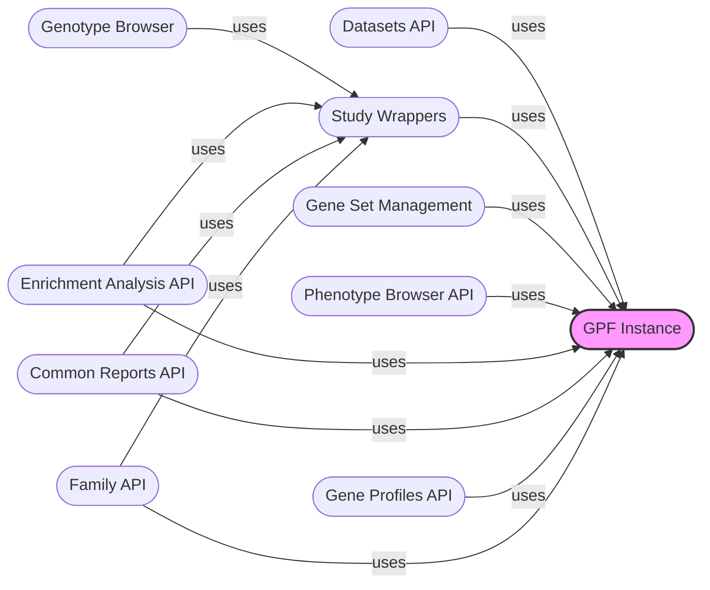

## GPF Instance Overview

The GPF Instance is the central component responsible for managing and providing access to genomic data, resources, and analysis configurations within the WDAE. It acts as a singleton, ensuring consistent access to data and configurations throughout the application.

### Component Descriptions

*   **GPF Instance:** The central component that manages and provides access to genomic data, resources, and analysis configurations. It serves as a singleton within the WDAE, ensuring consistent access to data and configurations. It is used by almost all other components to access data and configurations.
    *   Relevant source files:
        *   `dae/gpf_instance/gpf_instance.py`
        *   `gpf_instance/gpf_instance.py`

*   **Datasets API:** Provides API endpoints for accessing and managing datasets, including permissions and descriptions. It uses the GPF Instance to retrieve dataset information.
    *   Relevant source files:
        *   `datasets_api/views.py`
        *   `datasets_api/permissions.py`
        *   `datasets_api/models.py`

*   **Study Wrappers:** Wraps study data (both genotype and phenotype) for easier access and manipulation. It uses the GPF instance to retrieve study data and provides a unified interface. It is used by components that need to access study-specific data.
    *   Relevant source files:
        *   `studies/study_wrapper.py`

*   **Gene Set Management:** Handles gene set operations, including loading, retrieving, and managing gene sets. It interacts with the GPF instance to access gene set databases.
    *   Relevant source files:
        *   `dae/gene_sets/gene_sets_db.py`
        *   `dae/gene_sets/denovo_gene_sets_db.py`

*   **Genotype Browser:** Provides functionalities for browsing and querying genotype data. It uses the study wrappers to access genotype data and the GPF instance for configuration.
    *   Relevant source files:
        *   `repos/gpf/wdae/wdae/genotype_browser/views.py`

*   **Phenotype Browser API:** Provides API endpoints for accessing and exploring phenotype data. It uses the GPF instance to retrieve phenotype data and configurations.
    *   Relevant source files:
        *   `repos/gpf/wdae/wdae/pheno_browser_api/views.py`

*   **Enrichment Analysis API:** Provides API endpoints for performing enrichment analysis. It uses the GPF instance and study wrappers to access the necessary data for the analysis.
    *   Relevant source files:
        *   `repos/gpf/wdae/wdae/enrichment_api/views.py`

*   **Common Reports API:** Provides API endpoints for generating and accessing common reports. It uses the GPF instance and study wrappers to access the data for generating reports.
    *   Relevant source files:
        *   `repos/gpf/wdae/wdae/common_reports_api/views.py`

*   **Gene Profiles API:** Provides API endpoints for accessing gene profiles. It uses the GPF instance to retrieve gene profile data.
    *   Relevant source files:
        *   `repos/gpf/wdae/wdae/gene_profiles_api/views.py`

*   **Family API:** Provides API endpoints for accessing family data. It uses the GPF instance and study wrappers to access family information.
    *   Relevant source files:
        *   `repos/gpf/wdae/wdae/family_api/views.py`