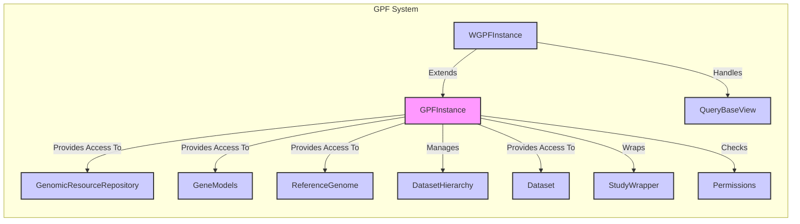

### Component Description

**GPFInstance:**
*   **Purpose:** Serves as the central access point for genomic resources, datasets, and configurations within the GPF system. It initializes and manages the various components required for data access and analysis.
*   **Functionality:** Provides methods to access genomic resources (reference genome, gene models), datasets, and study wrappers. It also manages the dataset hierarchy and interacts with the permissions system.
*   **Relationships:**
    *   Provides access to `GenomicResourceRepository`, `GeneModels`, and `ReferenceGenome` for genomic data.
    *   Manages `DatasetHierarchy` to define relationships between datasets.
    *   Provides access to `Dataset` objects.
    *   Wraps `StudyWrapper` instances to provide access to study-specific data.
    *   Checks `Permissions` to control access to data.
*   **Relevant source files:** `dae.gpf_instance.gpf_instance.GPFInstance`

**WGPFInstance:**
*   **Purpose:** Extends `GPFInstance` to provide web-specific functionalities for WDAE, including dataset management, permissions handling, and configuration preparation for the web interface. It adapts the core GPFInstance for web-based access and management.
*   **Functionality:** Extends GPFInstance to handle web-related configurations and dataset access. It also prepares data for the web interface and manages user permissions.
*   **Relationships:**
    *   Extends `GPFInstance`.
    *   Handles `QueryBaseView` for web-based queries.
*   **Relevant source files:** `dae.gpf_instance.gpf_instance.WGPFInstance`

**GenomicResourceRepository:**
*   **Purpose:** Manages genomic resources by providing access to reference genomes, gene models, and other related data. It abstracts the underlying storage and retrieval mechanisms for genomic resources.
*   **Functionality:** Provides methods to access and manage genomic resources, such as reference genomes and gene models.
*   **Relationships:**
    *   Accessed by `GPFInstance` to retrieve genomic resources.
*   **Relevant source files:** `dae.genomic_resources.repository_factory.build_genomic_resource_repository`, `dae.genomic_resources.group_repository.GenomicResourceGroupRepo`

**GeneModels:**
*   **Purpose:** Represents gene models, allowing loading and accessing transcript information. It provides structured access to gene annotations, including exons, transcripts, and coding regions.
*   **Functionality:** Provides methods to load and access gene models, including transcript information.
*   **Relationships:**
    *   Accessed by `GPFInstance` to retrieve gene models.
*   **Relevant source files:** `dae.genomic_resources.gene_models.gene_models.build_gene_models_from_resource`, `dae.genomic_resources.gene_models.gene_models.GeneModels.load`

**ReferenceGenome:**
*   **Purpose:** Represents the reference genome, providing access to sequence information. It allows querying specific regions of the genome and retrieving the corresponding nucleotide sequence.
*   **Functionality:** Provides methods to access the reference genome sequence.
*   **Relationships:**
    *   Accessed by `GPFInstance` to retrieve sequence information.
*   **Relevant source files:** `dae.genomic_resources.reference_genome.build_reference_genome_from_resource`, `dae.genomic_resources.reference_genome.ReferenceGenome.open`

**DatasetHierarchy:**
*   **Purpose:** Manages the hierarchical relationships between datasets. It defines the parent-child relationships between datasets, enabling inheritance of permissions and metadata.
*   **Functionality:** Manages the hierarchy of datasets.
*   **Relationships:**
    *   Managed by `GPFInstance`.
*   **Relevant source files:** `datasets_api.models.DatasetHierarchy.clear`, `datasets_api.models.DatasetHierarchy.add_relation`

**Dataset:**
*   **Purpose:** Represents a dataset in the system, providing functionalities to manage dataset permissions and hierarchy. It encapsulates dataset-specific metadata and access control information.
*   **Functionality:** Represents a dataset and its metadata.
*   **Relationships:**
    *   Managed by `GPFInstance`.
*   **Relevant source files:** `datasets_api.models.Dataset`

**StudyWrapper:**
*   **Purpose:** Wraps a study, providing access to study-specific data and functionalities within the WDAE environment. It adapts the underlying study data for use within the web application.
*   **Functionality:** Wraps a study for use within WDAE.
*   **Relationships:**
    *   Wrapped by `GPFInstance`.
*   **Relevant source files:** `studies.study_wrapper.StudyWrapper`, `studies.study_wrapper.WDAEStudy`

**Permissions:**
*   **Purpose:** Handles dataset permissions and determines user access rights. It enforces access control policies, ensuring that users can only access data they are authorized to view.
*   **Functionality:** Manages dataset permissions.
*   **Relationships:**
    *   Checked by `GPFInstance`.
*   **Relevant source files:** `datasets_api.permissions.IsDatasetAllowed.permitted_datasets`, `datasets_api.permissions.user_has_permission`

**QueryBaseView:**
*   **Purpose:** Base view for handling queries, managing permissions, and accessing datasets. It provides a common foundation for query endpoints, handling authentication and authorization.
*   **Functionality:** Handles queries, permissions, and dataset access for web views.
*   **Relationships:**
    *   Handled by `WGPFInstance`.
*   **Relevant source files:** `repos.gpf.wdae.wdae.query_base.query_base.QueryBaseView`
