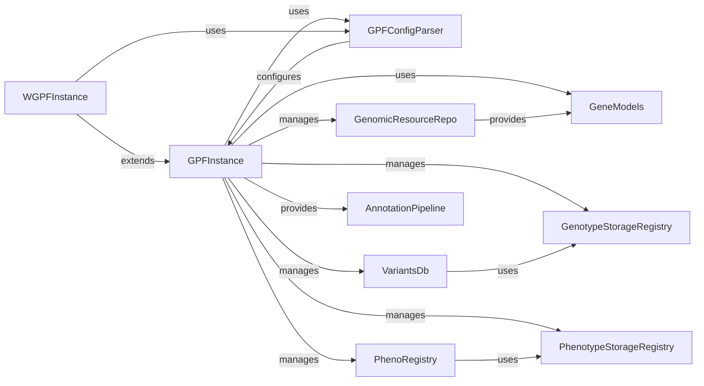

## Component Details

This overview focuses on the `GPFInstance` and its most fundamental interacting components, which together form the core data management and access layer of the GPF system. These components are chosen for their direct involvement in the initialization, configuration, and provision of genomic and phenotypic data, making them indispensable for any operation within the GPF framework.

### GPFInstance
The absolute core of the GPF system, `GPFInstance` is responsible for managing the fundamental GPF configurations, genotype data, and phenotype data. It acts as the single source of truth for genomic and phenotypic data within the system, providing essential methods for accessing and building the GPF environment. It's the bedrock upon which all other data-related functionalities are built.

**Related Classes/Methods**:

- `GPFInstance` (1:1)

### WGPFInstance
This class extends `GPFInstance` and specifically caters to the needs of the WDAE (Web-based Data Analysis Environment) application. It wraps the core `GPFInstance` functionalities and adds WDAE-specific features, such as managing WDAE study wrappers and preparing configurations for the web interface.

**Related Classes/Methods**:

- `WGPFInstance` (1:1)

### GPFConfigParser
Parses GPF configuration files, providing the necessary settings and paths for `GPFInstance` to initialize and locate various data resources and services.

**Related Classes/Methods**:

- `GPFConfigParser` (1:1)

### GenomicResourceRepo
Manages and provides access to various genomic resources, such as reference genomes, gene models, and scores, which are fundamental for genomic data analysis.

**Related Classes/Methods**:

- `GenomicResourceRepo` (1:1)

### GeneModels
Manages gene model data, providing information about gene structures, exons, and transcripts. This data is crucial for variant annotation and understanding their impact.

**Related Classes/Methods**:

- <a href="https://github.com/iossifovlab/gpf/blob/master/dae/dae/genomic_resources/gene_models/gene_models.py#L420-L573" target="_blank" rel="noopener noreferrer">`GeneModels` (420:573)</a>

### GenotypeStorageRegistry
Manages the registration and retrieval of different genotype storage backends, allowing `GPFInstance` to connect to various sources of raw genotype data.

**Related Classes/Methods**:

- <a href="https://github.com/iossifovlab/gpf/blob/master/dae/dae/genotype_storage/genotype_storage_registry.py#L9-L103" target="_blank" rel="noopener noreferrer">`GenotypeStorageRegistry` (9:103)</a>

### VariantsDb
Manages and provides access to genotype data (studies and groups), abstracting the underlying storage mechanisms. It's the primary interface for querying variant information.

**Related Classes/Methods**:

- <a href="https://github.com/iossifovlab/gpf/blob/master/dae/dae/studies/variants_db.py#L237-L591" target="_blank" rel="noopener noreferrer">`VariantsDb` (237:591)</a>

### PhenotypeStorageRegistry
Manages the registration and retrieval of different phenotype storage backends, allowing `GPFInstance` to connect to various sources of phenotype data.

**Related Classes/Methods**:

- `PhenotypeStorageRegistry` (1:1)

### PhenoRegistry
Manages and accesses phenotype data, providing a unified interface for retrieving phenotypic information associated with individuals or families.

**Related Classes/Methods**:

- `PhenoRegistry` (1:1)

### AnnotationPipeline
Provides an annotation pipeline for genomic variants, applying various annotators to enrich variant data with functional and clinical information.

**Related Classes/Methods**:

- <a href="https://github.com/iossifovlab/gpf/blob/master/dae/dae/annotation/annotation_pipeline.py#L96-L237" target="_blank" rel="noopener noreferrer">`AnnotationPipeline` (96:237)</a>

### [FAQ](https://github.com/CodeBoarding/GeneratedOnBoardings/tree/main?tab=readme-ov-file#faq)