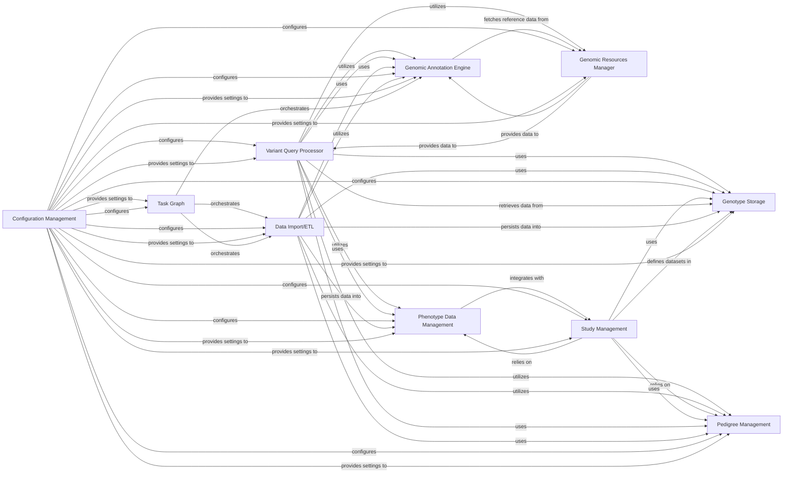

## Details

The `GPF Core` component serves as the foundational layer of the Genomic Data Platform, providing essential functionalities for data access, querying, and management of genomic and phenotypic information. Its architecture is modular, with clearly defined components that interact to support complex bioinformatics workflows.

### Genotype Storage
This component provides an abstract and pluggable interface for storing and retrieving raw genomic variant data (genotypes). It decouples the core system from specific backend storage solutions, allowing for flexibility (e.g., DuckDB, Impala, in-memory). It manages the physical persistence and retrieval of variant data.

**Related Classes/Methods**:

- `gpf/genotype_storage/genotype_storage.py` (1:1)
- `gpf/genotype_storage/genotype_storage_registry.py` (1:1)
- `gpf/duckdb_storage/duckdb_genotype_storage.py` (1:1)
- `gpf/inmemory_storage/inmemory_genotype_storage.py` (1:1)

### Variant Query Processor
Responsible for processing and executing complex queries against the stored genomic data. It translates high-level query requests into optimized operations for the underlying genotype storage, often incorporating filters based on genomic regions, gene effects, and phenotypic data.

**Related Classes/Methods**:

- `gpf/query_variants/base_query_variants.py` (1:1)
- `gpf/query_variants/sql/schema2/sql_query_builder.py` (1:1)

### Genomic Annotation Engine
This component applies various annotations (e.g., gene effects, genomic scores, liftover) to raw genomic variants, enriching the data with biological and functional context. It orchestrates annotation pipelines using different annotators and is crucial for downstream analysis.

**Related Classes/Methods**:

- `gpf/annotation/annotation_pipeline.py` (1:1)
- `gpf/annotation/annotator_base.py` (1:1)
- `gpf/effect_annotation/annotator.py` (1:1)

### Genomic Resources Manager
Manages access to and retrieval of various genomic reference data, such as reference genomes, gene models, and pre-computed genomic scores. It provides a standardized and cached way to access these resources, which are essential for annotation and analysis.

**Related Classes/Methods**:

- `gpf/genomic_resources/repository.py` (1:1)
- `gpf/genomic_resources/reference_genome.py` (1:1)
- `gpf/genomic_resources/gene_models/gene_models.py` (1:1)
- `gpf/genomic_resources/genomic_scores.py` (1:1)

### Phenotype Data Management
Handles the storage, organization, and querying of phenotypic data associated with individuals and families. It supports the integration of clinical and phenotypic information with genomic data, enabling phenotype-genotype correlation studies.

**Related Classes/Methods**:

- `gpf/pheno/pheno_data.py` (1:1)
- `gpf/pheno/db.py` (1:1)

### Data Import/ETL
Provides tools and workflows for ingesting raw genomic and phenotypic data from various external formats (e.g., VCF, TSV, PED) into the system's internal storage formats. It orchestrates the transformation, annotation, and loading of data.

**Related Classes/Methods**:

- `gpf/import_tools/import_tools.py` (1:1)
- `gpf/variants_loaders/vcf/loader.py` (1:1)
- `gpf/variants_loaders/cnv/loader.py` (1:1)
- `gpf/variants_loaders/dae/loader.py` (1:1)

### Study Management [[Expand]](./Study_Management.md)
Manages the definition, configuration, and access to individual genomic studies or datasets within the platform. It aggregates information about variants, pedigrees, and associated phenotypic data for each study, providing a logical grouping of data.

**Related Classes/Methods**:

- `gpf/studies/study.py` (1:1)
- `gpf/studies/variants_db.py` (1:1)

### Pedigree Management
Handles the representation, loading, and manipulation of family pedigree data, including relationships, sex, and affected status. This is crucial for genetic inheritance analysis and family-based queries.

**Related Classes/Methods**:

- `gpf/pedigrees/family.py` (1:1)
- `gpf/pedigrees/loader.py` (1:1)
- `gpf/pedigrees/pedigrees.py` (1:1)

### Configuration Management [[Expand]](./Configuration_Management.md)
Manages the loading, parsing, and validation of configuration files for various parts of the `gpf` system, including study configurations, annotation pipelines, and storage backends. It ensures the system operates with correct and validated settings.

**Related Classes/Methods**:

- `gpf/configuration/gpf_config_parser.py` (1:1)
- `gpf/configuration/schemas/study_config.py` (1:1)

### Task Graph
Provides a framework for defining and executing computational tasks as a directed acyclic graph (DAG). This is used for orchestrating complex data processing workflows, such as data import, annotation, and report generation, ensuring dependencies are met and tasks are executed efficiently.

**Related Classes/Methods**:

- `gpf/task_graph/graph.py` (1:1)
- `gpf/task_graph/executor.py` (1:1)

### [FAQ](https://github.com/CodeBoarding/GeneratedOnBoardings/tree/main?tab=readme-ov-file#faq)