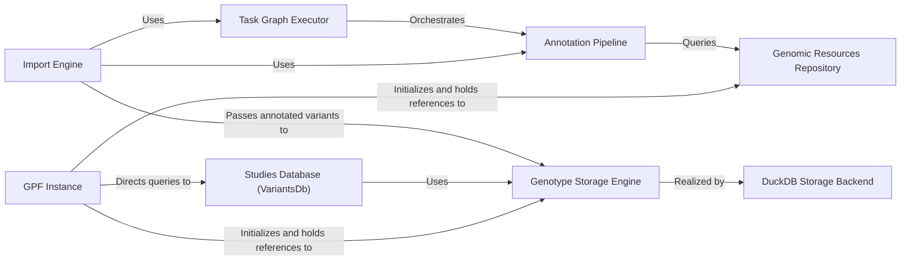

## Details

One paragraph explaining the functionality which is represented by this graph. What the main flow is and what is its purpose.

### GPF Instance
The central singleton and primary entry point to the DAE. It manages the configuration and provides access to all other core components like genomic studies, resources, and storage engines.

**Related Classes/Methods**: _None_

### Genomic Resources Repository
Manages and provides access to essential genomic data resources, such as reference genomes, gene models, and annotation score files. It ensures that these resources are loaded and accessed consistently.

**Related Classes/Methods**: _None_

### Genotype Storage Engine
An abstract interface defining how to store and query genotype data. This component enables a pluggable architecture, allowing different database backends (e.g., DuckDB, Impala) to be used for data storage.

**Related Classes/Methods**: _None_

### Studies Database (VariantsDb)
Manages all genomic studies within a GPF instance. It acts as a registry, loading study configurations and providing access to their corresponding genotype data and variants through the appropriate storage engine.

**Related Classes/Methods**: _None_

### Annotation Pipeline
Orchestrates the process of annotating genomic variants. It takes raw variant data and enriches it with additional information (e.g., gene effects, frequency data) by passing it through a sequence of configurable annotators.

**Related Classes/Methods**: _None_

### Import Engine
Manages the entire data import process, from raw data files (like VCF or pedigree files) to a fully annotated and stored study. It defines the import configuration and uses the Task Graph Executor to run the import workflow.

**Related Classes/Methods**: _None_

### Task Graph Executor
Executes complex, multi-step workflows as Directed Acyclic Graphs (DAGs). It is used by the Import Engine to manage the dependencies and execution of tasks like data loading, annotation, and storage.

**Related Classes/Methods**: _None_

### DuckDB Storage Backend
A concrete implementation of the Genotype Storage Engine that uses DuckDB for storing and querying genomic data. It handles the specific logic for interacting with DuckDB.

**Related Classes/Methods**: _None_

### [FAQ](https://github.com/CodeBoarding/GeneratedOnBoardings/tree/main?tab=readme-ov-file#faq)