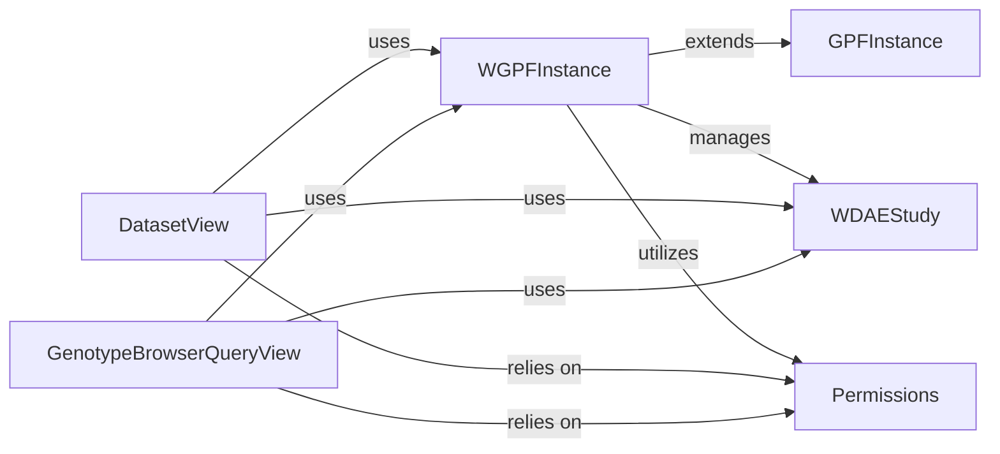

## Component Details

The `GPF Core Orchestration` subsystem is the central nervous system of the GPF system, responsible for managing fundamental configurations, controlling access to all genomic and phenotypic data, and coordinating interactions between various data-centric components. It ensures data consistency and controlled access across the platform. These components are fundamental to `GPF Core Orchestration` because they collectively manage the entire lifecycle of data access and presentation within the GPF system, from the core data representation (`GPFInstance`) to web-facing query processing and access control (`WGPFInstance`, `WDAEStudy`, `DatasetView`, `GenotypeBrowserQueryView`, `Permissions`). They form the backbone for how genomic and phenotypic data is configured, accessed, and secured.

### GPFInstance
The absolute core of the GPF system, `GPFInstance` is responsible for managing the fundamental GPF configurations, genotype data, and phenotype data. It provides the essential methods for accessing and building the GPF environment, acting as the single source of truth for genomic and phenotypic data within the system. It's the bedrock upon which all other data-related functionalities are built.

**Related Classes/Methods**:

- `GPFInstance` (-1:-1)

### WGPFInstance
A specialized wrapper around the core `GPFInstance`, `WGPFInstance` extends its functionalities with features tailored for the WDAE web application. This includes managing WDAE study wrappers, handling user permissions, and preparing GPF configurations for web consumption. It acts as the primary interface for web-based access to genotype and phenotype data, orchestrating how the web application interacts with the core GPF data.

**Related Classes/Methods**:

- `WGPFInstance` (-1:-1)

### WDAEStudy
This component serves as a wrapper for individual studies or groups of studies within the WDAE context. It provides methods to build genotype data descriptions, retrieve columns as data sources, and execute variant queries, abstracting the underlying data storage details for web consumption. It's crucial for providing a unified interface to diverse study data.

**Related Classes/Methods**:

- `WDAEStudy` (-1:-1)

### DatasetView
This API view handles requests related to datasets. Its responsibilities include collecting dataset summaries, retrieving detailed information, and applying accessibility and group-based augmentations before presenting the data to the user. It acts as a gateway for web clients to interact with dataset metadata, orchestrating the presentation of dataset information.

**Related Classes/Methods**:

- `DatasetView` (-1:-1)

### GenotypeBrowserQueryView
This component is responsible for processing complex genotype browsing queries originating from the web interface. It parses query parameters, verifies user permissions, expands gene sets and symbols, and dispatches these queries to the appropriate study wrappers for variant data retrieval. It directly orchestrates the flow of genotype data queries from the web to the underlying data sources.

**Related Classes/Methods**:

- `GenotypeBrowserQueryView` (-1:-1)

### Permissions
A utility component responsible for enforcing access control and filtering data based on user permissions for datasets and studies. It ensures that users can only access data they are authorized to view, making it a critical part of secure data orchestration.

**Related Classes/Methods**:

- <a href="https://github.com/iossifovlab/gpf/blob/master/wdae/wdae/datasets_api/permissions.py#L-1-L-1" target="_blank" rel="noopener noreferrer">`Permissions` (-1:-1)</a>

### [FAQ](https://github.com/CodeBoarding/GeneratedOnBoardings/tree/main?tab=readme-ov-file#faq)