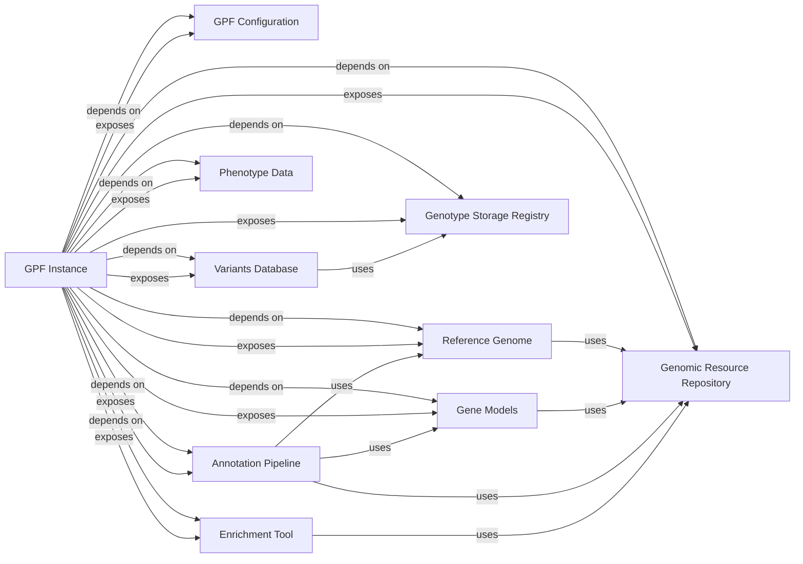

## Component Details

The `GPF Instance` component is the central orchestrator of the GPF system, providing unified access to global configurations and various data repositories and tools. It is fundamental because it acts as the single entry point for initializing and managing the core functionalities required for data ingestion, annotation, and analysis within the GPF ecosystem. Without the `GPF Instance`, other components would lack a cohesive way to access necessary resources and configurations, leading to a fragmented and unmanageable system.

### GPF Instance
The `GPF Instance` is the central component of the GPF system. It is responsible for initializing, configuring, and providing unified access to global configurations, registered genotype storages, the Genomic Resource Repository (GRR), and other core functionalities. It acts as an orchestrator, ensuring that various parts of the GPF system can seamlessly interact with necessary data and services.

**Related Classes/Methods**:

- <a href="https://github.com/iossifovlab/gpf/blob/master/dae/dae/gpf_instance/gpf_instance.py#L1-L1" target="_blank" rel="noopener noreferrer">`dae.dae.gpf_instance.gpf_instance` (1:1)</a>

### GPF Configuration
This component is responsible for loading and parsing the system's configuration files, particularly `gpf_instance.yaml`, which dictates the setup and behavior of the entire GPF instance. It ensures that all other components are initialized with the correct parameters and resource paths.

**Related Classes/Methods**:

- <a href="https://github.com/iossifovlab/gpf/blob/master/dae/dae/configuration/gpf_config_parser.py#L1-L1" target="_blank" rel="noopener noreferrer">`dae.dae.configuration.gpf_config_parser` (1:1)</a>

### Genomic Resource Repository
The GRR is a centralized system for managing and providing access to diverse genomic resources (e.g., reference genomes, gene models, genomic scores). It acts as a registry for all external genomic data.

**Related Classes/Methods**:

- <a href="https://github.com/iossifovlab/gpf/blob/master/dae/dae/genomic_resources/repository.py#L1-L1" target="_blank" rel="noopener noreferrer">`dae.dae.genomic_resources.repository` (1:1)</a>

### Reference Genome
This component represents the human reference genome and provides functionalities to access genomic sequences and perform coordinate transformations. It is essential for accurate variant localization and annotation.

**Related Classes/Methods**:

- <a href="https://github.com/iossifovlab/gpf/blob/master/dae/dae/genomic_resources/reference_genome.py#L1-L1" target="_blank" rel="noopener noreferrer">`dae.dae.genomic_resources.reference_genome` (1:1)</a>

### Gene Models
This component contains comprehensive definitions of genes and their transcripts, including exon and intron boundaries. This information is vital for predicting the functional impact of genetic variants.

**Related Classes/Methods**:

- <a href="https://github.com/iossifovlab/gpf/blob/master/dae/dae/genomic_resources/gene_models/gene_models.py#L1-L1" target="_blank" rel="noopener noreferrer">`dae.dae.genomic_resources.gene_models.gene_models` (1:1)</a>

### Genotype Storage Registry
This component acts as a registry for different genotype storage backends (e.g., DuckDB, Impala, in-memory databases). It allows the GPF system to seamlessly interact with various underlying data sources where variant data is stored.

**Related Classes/Methods**:

- <a href="https://github.com/iossifovlab/gpf/blob/master/dae/dae/genotype_storage/genotype_storage_registry.py#L1-L1" target="_blank" rel="noopener noreferrer">`dae.dae.genotype_storage.genotype_storage_registry` (1:1)</a>

### Variants Database
This component provides a unified interface for querying and retrieving genetic variant data, abstracting the complexities of the underlying genotype storage implementations. It's the primary way other parts of GPF access variant information.

**Related Classes/Methods**:

- <a href="https://github.com/iossifovlab/gpf/blob/master/dae/dae/studies/variants_db.py#L1-L1" target="_blank" rel="noopener noreferrer">`dae.dae.studies.variants_db` (1:1)</a>

### Annotation Pipeline
This configurable pipeline orchestrates the process of annotating genomic variants with various types of information, such as gene effects, conservation scores, and population frequencies, by utilizing resources from the GRR.

**Related Classes/Methods**:

- <a href="https://github.com/iossifovlab/gpf/blob/master/dae/dae/annotation/annotation_pipeline.py#L1-L1" target="_blank" rel="noopener noreferrer">`dae.dae.annotation.annotation_pipeline` (1:1)</a>

### Enrichment Tool
This component facilitates the statistical analysis of gene sets to determine if certain sets are significantly over-represented or under-represented in a given list of genes.

**Related Classes/Methods**:

- <a href="https://github.com/iossifovlab/gpf/blob/master/dae/dae/enrichment_tool/enrichment_builder.py#L1-L1" target="_blank" rel="noopener noreferrer">`dae.dae.enrichment_tool.enrichment_builder` (1:1)</a>

### Phenotype Data
This component manages and provides access to phenotypic information (e.g., clinical traits, demographic data) associated with individuals and families within studies. It enables integrated genetic and phenotypic analysis.

**Related Classes/Methods**:

- <a href="https://github.com/iossifovlab/gpf/blob/master/dae/dae/pheno/pheno_data.py#L1-L1" target="_blank" rel="noopener noreferrer">`dae.dae.pheno.pheno_data` (1:1)</a>

### [FAQ](https://github.com/CodeBoarding/GeneratedOnBoardings/tree/main?tab=readme-ov-file#faq)