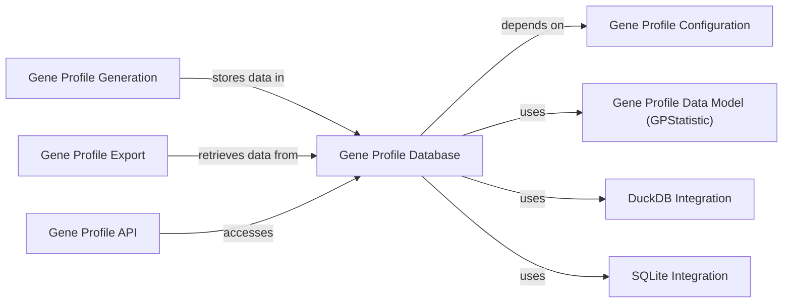

## Component Details

This subsystem is designed to manage and provide access to gene expression profiles and related gene-specific data. It acts as a central repository, enabling various gene profiling analyses and data dissemination.

### Gene Profile Database
This is the central component responsible for storing, managing, and retrieving gene expression profiles and other gene-specific data. It provides methods for querying, filtering, and accessing gene data efficiently. It abstracts the underlying database technology.

**Related Classes/Methods**:

- `Gene Profile Database` (1:1)

### Gene Profile Generation
This component is responsible for creating and populating the gene profile data that the `Gene Profile Database` stores. It likely involves processing raw genetic data into structured gene profiles.

**Related Classes/Methods**:

- `Gene Profile Generation` (1:1)

### Gene Profile Export
This component facilitates the extraction and serialization of gene profiles from the `Gene Profile Database` into various formats, allowing users or other systems to utilize the data outside the immediate application.

**Related Classes/Methods**:

- `Gene Profile Export` (1:1)

### Gene Profile API
This component serves as the primary interface for external systems or user interfaces to interact with and consume the gene profile data managed by the `Gene Profile Database`. It exposes functionalities for querying and retrieving gene profiles.

**Related Classes/Methods**:

- `Gene Profile API` (1:1)

### Gene Profile Configuration
This component defines the schema, structure, and rules for the gene profile data. The `Gene Profile Database` relies heavily on this configuration to correctly interpret, store, and process the gene profile information, including gene scores, gene sets, and dataset-specific statistics.

**Related Classes/Methods**:

- `Gene Profile Configuration` (1:1)

### Gene Profile Data Model (GPStatistic)
This component defines the standardized data structure for a single gene profile. It ensures consistency and ease of use across different parts of the system that interact with gene profile data, acting as the canonical representation of a gene profile.

**Related Classes/Methods**:

- `Gene Profile Data Model (GPStatistic)` (1:1)

### DuckDB Integration
This component represents the primary underlying in-process SQL OLAP database technology used by the `Gene Profile Database` for efficient storage and retrieval of gene profile data. It handles the actual persistence layer operations.

**Related Classes/Methods**:

- `DuckDB Integration` (1:1)

### SQLite Integration
This component represents the legacy or alternative underlying database technology that the `Gene Profile Database` can support for persistence. It provides compatibility with older data formats or deployment scenarios.

**Related Classes/Methods**:

- `SQLite Integration` (1:1)

### [FAQ](https://github.com/CodeBoarding/GeneratedOnBoardings/tree/main?tab=readme-ov-file#faq)