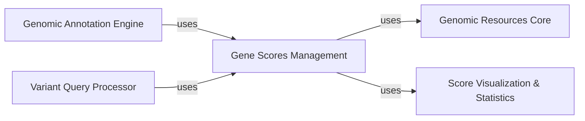

## Details

This component is central to handling and providing access to pre-computed gene-level scores, which are essential for prioritizing genes and variants based on their predicted functional importance or pathogenicity. It integrates deeply with the platform's genomic resource management and annotation capabilities.

### Gene Scores Management [[Expand]](./Gene_Scores_Management.md)
This component is responsible for the lifecycle of gene-level scores, including their loading, parsing, validation, and retrieval. It provides an API to access score definitions, retrieve score values for specific genes, and manage associated statistical data like histograms. It acts as the primary interface for all gene score-related operations.

**Related Classes/Methods**:

- <a href="https://github.com/iossifovlab/gpf/dae/dae/gene_scores/gene_scores.py#L47-L324" target="_blank" rel="noopener noreferrer">`dae.gene_scores.gene_scores.GeneScore` (47:324)</a>
- <a href="https://github.com/iossifovlab/gpf/dae/dae/gene_scores/gene_scores.py#L35-L44" target="_blank" rel="noopener noreferrer">`dae.gene_scores.gene_scores.ScoreDef` (35:44)</a>

### Genomic Resources Core
This foundational component provides a unified framework for managing and accessing all types of genomic resources, including gene scores, reference genomes, and gene models. It handles resource discovery, configuration, and provides a standardized interface for loading and interacting with diverse genomic datasets.

**Related Classes/Methods**:

- <a href="https://github.com/iossifovlab/gpf/dae/dae/genomic_resources/genomic_scores.py#L235-L746" target="_blank" rel="noopener noreferrer">`dae.genomic_resources.genomic_scores.GenomicScore` (235:746)</a>
- <a href="https://github.com/iossifovlab/gpf/dae/dae/genomic_resources/repository.py#L1-L100" target="_blank" rel="noopener noreferrer">`dae.genomic_resources.repository.GenomicResource` (1:100)</a>

### Score Visualization & Statistics
This component focuses on the generation, storage, and retrieval of statistical summaries and visualizations (primarily histograms) for various genomic scores. It enables users and other components to understand the distribution and characteristics of score values, which is crucial for data quality assessment and informed analysis.

**Related Classes/Methods**:

- <a href="https://github.com/iossifovlab/gpf/dae/dae/genomic_resources/histogram.py#L1-L100" target="_blank" rel="noopener noreferrer">`dae.genomic_resources.histogram.NumberHistogramConfig` (1:100)</a>
- <a href="https://github.com/iossifovlab/gpf/dae/dae/genomic_resources/histogram.py#L1-L100" target="_blank" rel="noopener noreferrer">`dae.genomic_resources.histogram.CategoricalHistogramConfig` (1:100)</a>
- <a href="https://github.com/iossifovlab/gpf/dae/dae/genomic_resources/histogram.py#L1-L100" target="_blank" rel="noopener noreferrer">`dae.genomic_resources.histogram.load_histogram` (1:100)</a>
- <a href="https://github.com/iossifovlab/gpf/dae/dae/genomic_resources/draw_score_histograms.py#L1-L100" target="_blank" rel="noopener noreferrer">`dae.genomic_resources.draw_score_histograms` (1:100)</a>

### Genomic Annotation Engine
This component is responsible for enriching raw genomic variant data by applying various annotations from diverse genomic resources, including gene scores. It integrates gene-level context into variant records, which is vital for interpreting their potential impact.

**Related Classes/Methods**: _None_

### Variant Query Processor
This component handles complex queries against genomic variant datasets, often leveraging gene scores for filtering, prioritization, and retrieval of specific variants. It enables users to efficiently search and retrieve variants based on their associated gene-level characteristics.

**Related Classes/Methods**: _None_

### [FAQ](https://github.com/CodeBoarding/GeneratedOnBoardings/tree/main?tab=readme-ov-file#faq)