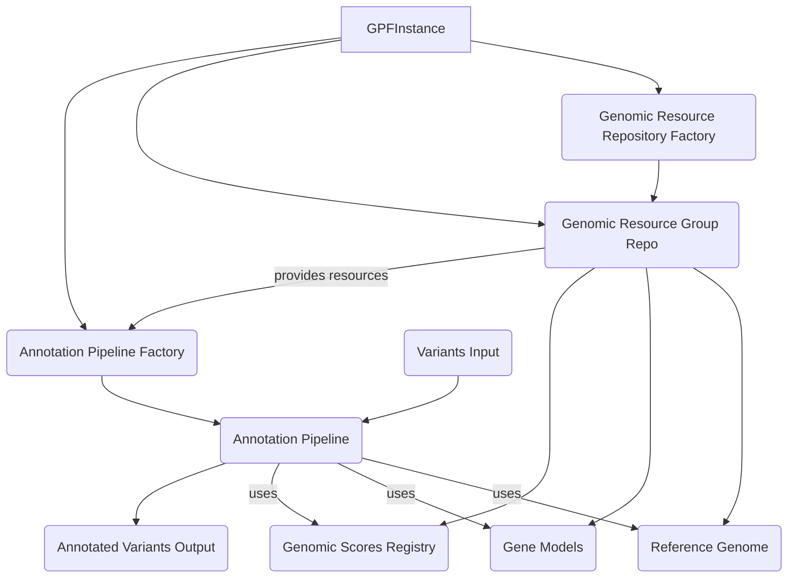

## Genomic Context & Annotation Overview

This component is responsible for managing genomic resources such as reference genomes, gene models, and genomic scores, and for applying these resources to annotate genetic variants. The core process involves setting up access to genomic resources and configuring an annotation pipeline that utilizes these resources to add relevant information to variants.

### Component Descriptions

**GPFInstance**
*   **Description:** Central object managing access to various DAE resources and functionalities. It orchestrates the building of resource repositories, annotation pipelines, and access to genomic resources like genomes, gene models, and scores.
*   **Source Files:** `dae.gpf_instance.gpf_instance.py`
*   **Interactions:** Interacts with `Genomic Resource Repository Factory` to get the resource repository, with `Genomic Resource Group Repo` to access specific resources, and with `Annotation Pipeline Factory` to build the annotation pipeline.

**Genomic Resource Repository Factory**
*   **Description:** Responsible for creating instances of genomic resource repositories based on configuration. It is used by `GPFInstance` during initialization.
*   **Source Files:** `dae.genomic_resources.repository_factory.py`
*   **Interactions:** Creates instances of `Genomic Resource Group Repo`.

**Genomic Resource Group Repo**
*   **Description:** Manages a collection of genomic resources and provides methods to retrieve specific resources by ID. It is built by the `Genomic Resource Repository Factory` and used by `GPFInstance` and the `Annotation Pipeline Factory`.
*   **Source Files:** `dae.genomic_resources.group_repository.py`
*   **Interactions:** Provides `Reference Genome`, `Gene Models`, `Genomic Scores Registry`, and other resources needed by the `Annotation Pipeline Factory`.

**Reference Genome**
*   **Description:** Represents a reference genome sequence, providing methods to access sequence data for specific chromosomal locations. It is built from a genomic resource and used by the `Annotation Pipeline` during annotation.
*   **Source Files:** `dae.genomic_resources.reference_genome.py`
*   **Interactions:** Used by the `Annotation Pipeline` to retrieve genomic sequences for variant annotation.

**Gene Models**
*   **Description:** Represents gene models, providing information about genes, transcripts, exons, and their locations. It is built from a genomic resource and used by the `Annotation Pipeline` for gene-based annotation.
*   **Source Files:** `dae.genomic_resources.gene_models.gene_models.py`
*   **Interactions:** Used by the `Annotation Pipeline` to determine the functional consequence of variants relative to gene structures.

**Genomic Scores Registry**
*   **Description:** Manages a collection of genomic scores (like conservation scores, pathogenicity scores) and provides access to them. It is built from genomic resources and used by the `Annotation Pipeline` to add score annotations to variants.
*   **Source Files:** `dae.genomic_scores.scores.py`
*   **Interactions:** Provides genomic score data to the `Annotation Pipeline` for variant annotation.

**Annotation Pipeline Factory**
*   **Description:** Responsible for building instances of the `Annotation Pipeline` based on a configuration. It uses genomic resources provided by the `Genomic Resource Group Repo` to configure the annotators within the pipeline.
*   **Source Files:** `dae.annotation.annotation_factory.py`
*   **Interactions:** Receives resources from `Genomic Resource Group Repo` and creates an `Annotation Pipeline` instance.

**Annotation Pipeline**
*   **Description:** Represents a sequence of annotators that process genetic variants. It takes variants as input, applies the configured annotators using resources like the `Reference Genome`, `Gene Models`, and `Genomic Scores Registry`, and outputs annotated variants.
*   **Source Files:** `dae.annotation.annotation_pipeline.py`
*   **Interactions:** Takes `Variants Input`, uses `Reference Genome`, `Gene Models`, and `Genomic Scores Registry` to perform annotation, and produces `Annotated Variants Output`.
