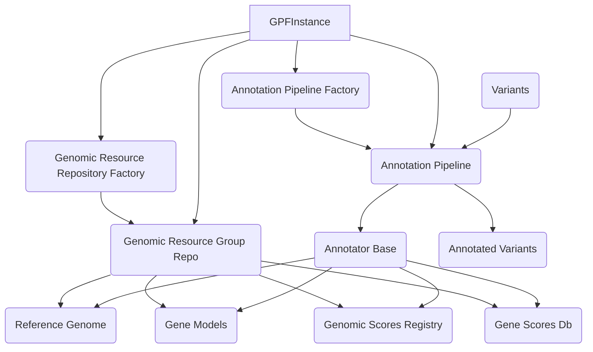

## Genomic Context & Annotation Overview

This component handles the management of genomic resources (genomes, gene models, scores) and the process of annotating genetic variants with information from these resources.

### Component Descriptions:

*   **GPFInstance**
    *   *Description*: Central object managing access to various DAE resources and functionalities. It initializes and provides access to the Genomic Resource Repository, Annotation Pipeline, and other resources like Reference Genome, Gene Models, and Genomic Scores.
    *   *Relevant Files*: `dae.gpf_instance.gpf_instance`
    *   *Relationships*: Uses `Genomic Resource Repository Factory` to build repositories, accesses resources via `Genomic Resource Group Repo`, uses `Annotation Pipeline Factory` to build pipelines, and uses the `Annotation Pipeline` to annotate variants.

*   **Genomic Resource Repository Factory**
    *   *Description*: Creates instances of genomic resource repositories based on configuration.
    *   *Relevant Files*: `dae.genomic_resources.repository_factory`
    *   *Relationships*: Used by `GPFInstance` to create `Genomic Resource Group Repo` instances.

*   **Genomic Resource Group Repo**
    *   *Description*: Manages a collection of genomic resources (genomes, gene models, scores, etc.) and provides methods to retrieve specific resources by ID.
    *   *Relevant Files*: `dae.genomic_resources.group_repository`
    *   *Relationships*: Created by `Genomic Resource Repository Factory` and accessed by `GPFInstance` to provide resources like `Reference Genome`, `Gene Models`, `Genomic Scores Registry`, and `Gene Scores Db`.

*   **Reference Genome**
    *   *Description*: Represents a reference genome sequence, loaded from genomic resources.
    *   *Relevant Files*: `dae.genomic_resources.reference_genome`
    *   *Relationships*: Provided by `Genomic Resource Group Repo` and used by `Annotator Base` implementations within the `Annotation Pipeline`.

*   **Gene Models**
    *   *Description*: Represents gene models (genes, transcripts, exons), loaded from genomic resources.
    *   *Relevant Files*: `dae.genomic_resources.gene_models.gene_models`
    *   *Relationships*: Provided by `Genomic Resource Group Repo` and used by `Annotator Base` implementations within the `Annotation Pipeline`.

*   **Genomic Scores Registry**
    *   *Description*: Manages a collection of genomic scores (e.g., conservation scores, pathogenicity scores), loaded from genomic resources.
    *   *Relevant Files*: `dae.genomic_scores.scores`
    *   *Relationships*: Provided by `Genomic Resource Group Repo` and used by `Annotator Base` implementations within the `Annotation Pipeline`.

*   **Gene Scores Db**
    *   *Description*: Manages and provides access to gene scores, used by GPFInstance and potentially annotators.
    *   *Relevant Files*: `dae.gene_scores.gene_scores`
    *   *Relationships*: Provided by `Genomic Resource Group Repo` and used by `Annotator Base` implementations within the `Annotation Pipeline`.

*   **Annotation Pipeline Factory**
    *   *Description*: Responsible for building `Annotation Pipeline` instances based on a configuration.
    *   *Relevant Files*: `dae.annotation.annotation_factory`
    *   *Relationships*: Used by `GPFInstance` to create `Annotation Pipeline` instances.

*   **Annotation Pipeline**
    *   *Description*: Represents a sequence of `Annotator Base` implementations applied to genetic variants. It takes variants as input and produces annotated variants by applying each annotator in order.
    *   *Relevant Files*: `dae.annotation.annotation_pipeline`
    *   *Relationships*: Created by `Annotation Pipeline Factory`, used by `GPFInstance`, processes `Variants`, produces `Annotated Variants`, and is composed of/uses `Annotator Base` implementations.

*   **Annotator Base**
    *   *Description*: Base class defining the interface for individual annotators within the `Annotation Pipeline`. Concrete implementations perform specific annotation tasks.
    *   *Relevant Files*: `dae.annotation.annotator_base`
    *   *Relationships*: Used by the `Annotation Pipeline` and utilizes resources like `Reference Genome`, `Gene Models`, `Genomic Scores Registry`, and `Gene Scores Db` to perform annotation.
