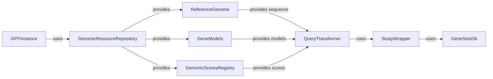

## Genomic Resource Management Overview

This component manages and provides access to genomic resources, such as reference genomes, gene models, and annotation scores. It allows other components to retrieve and utilize these resources for annotation and analysis.

### Component Descriptions:

*   **GPFInstance**: Represents the main GPF instance, providing access to various data and functionalities, including genomic resources. It initializes and manages the `GenomicResourceRepository`. **Relevant source files:** `dae.gpf_instance.gpf_instance.GPFInstance`

*   **GenomicResourceRepository**: Manages genomic resources like reference genomes and gene models. It provides functionalities to create, access, and manage these resources. It is used by `GPFInstance` to manage available resources and provides resources to `ReferenceGenome`, `GeneModels`, and `GenomicScoresRegistry`. **Relevant source files:** `dae.genomic_resources.repository_factory.build_genomic_resource_repository`

*   **ReferenceGenome**: Provides access to the reference genome sequence. It allows retrieving specific sequences based on genomic coordinates. It is used by `QueryTransformer` to retrieve reference sequences for variant annotation. **Relevant source files:** `dae.genomic_resources.reference_genome.build_reference_genome_from_resource`

*   **GeneModels**: Provides access to gene models and transcript information. It allows retrieving transcript structures, exons, and other gene-related information. It is used by `QueryTransformer` to retrieve gene models for variant annotation. **Relevant source files:** `dae.genomic_resources.gene_models.gene_models.build_gene_models_from_resource`

*   **GenomicScoresRegistry**: Manages and provides access to genomic scores. It allows retrieving scores for specific genomic regions. It is used by `QueryTransformer` to retrieve genomic scores for variant annotation. **Relevant source files:** `dae.genomic_scores.scores.GenomicScoresRegistry.get_scores`

*   **QueryTransformer**: Transforms and optimizes queries for variant data. It prepares queries for efficient data retrieval by using `ReferenceGenome`, `GeneModels`, and `GenomicScoresRegistry`. **Relevant source files:** `studies.query_transformer.QueryTransformer.transform_kwargs`

*   **StudyWrapper**: Wraps a study and provides a consistent interface for accessing variant data. It simplifies access to study-specific information and uses the transformed queries from `QueryTransformer`. **Relevant source files:** `repos.gpf.dae.dae.studies.study_wrapper.StudyWrapper`

*   **GeneSetsDb**: Provides access to gene sets and their definitions. It allows retrieving gene sets based on their names or other criteria and is used by `StudyWrapper`. **Relevant source files:** `dae.gene_sets.gene_sets_db.GeneSetsDb.get_gene_set`
