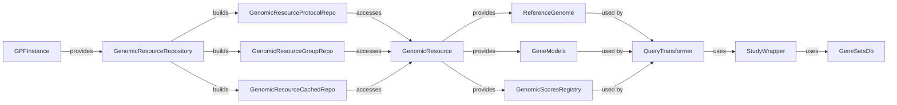

## Genomic Resource Management Overview

This component manages and provides access to genomic resources, such as reference genomes, gene models, and annotation scores. It allows other components to retrieve and utilize these resources for annotation and analysis.

Here's a data flow diagram illustrating the main interactions:

### Component Descriptions:

- **GPFInstance**:
  - *Description*: Represents the main GPF instance, providing access to various data and functionalities, including genomic resources.
  - *Functionality*: Initializes and manages the genomic resource repository, gene models, and other data structures.
  - *Interaction*: Provides access to the `GenomicResourceRepository`.
  - *Relevant source files*: `dae.gpf_instance.gpf_instance.GPFInstance`

- **GenomicResourceRepository**:
  - *Description*: Manages genomic resources by building different types of repositories based on configuration.
  - *Functionality*: Builds and manages `GenomicResourceProtocolRepo`, `GenomicResourceGroupRepo`, and `GenomicResourceCachedRepo`.
  - *Interaction*: Builds and provides access to specific genomic resources.
  - *Relevant source files*: `dae.genomic_resources.repository_factory.build_genomic_resource_repository`

- **GenomicResourceProtocolRepo**:
  - *Description*: A repository that uses a protocol (e.g., HTTP, file) to access genomic resources.
  - *Functionality*: Implements access to genomic resources via a specified protocol.
  - *Interaction*: Accesses and retrieves `GenomicResource` data.
  - *Relevant source files*: `dae.genomic_resources.repository.GenomicResourceProtocolRepo`

- **GenomicResourceGroupRepo**:
  - *Description*: A repository that groups other repositories.
  - *Functionality*: Manages a group of genomic resource repositories.
  - *Interaction*: Provides access to a collection of `GenomicResource` objects from different repositories.
  - *Relevant source files*: `dae.genomic_resources.group_repository.GenomicResourceGroupRepo`

- **GenomicResourceCachedRepo**:
  - *Description*: A repository that caches genomic resources.
  - *Functionality*: Caches genomic resources for faster access.
  - *Interaction*: Provides cached access to `GenomicResource` data.
  - *Relevant source files*: `dae.genomic_resources.cached_repository.GenomicResourceCachedRepo`

- **GenomicResource**:
  - *Description*: Represents a single genomic resource, providing access to its metadata and data.
  - *Functionality*: Provides a uniform interface to access genomic resource data and metadata.
  - *Interaction*: Provides data to `ReferenceGenome`, `GeneModels`, and `GenomicScoresRegistry`.
  - *Relevant source files*: `dae.genomic_resources.repository.GenomicResource`

- **ReferenceGenome**:
  - *Description*: Provides access to the reference genome sequence.
  - *Functionality*: Loads and provides access to the reference genome sequence and associated metadata.
  - *Interaction*: Used by `QueryTransformer` to retrieve genomic sequences.
  - *Relevant source files*: `dae.genomic_resources.reference_genome.build_reference_genome_from_resource`

- **GeneModels**:
  - *Description*: Provides access to gene models and transcript information.
  - *Functionality*: Loads and provides access to gene models, transcripts, and exon information.
  - *Interaction*: Used by `QueryTransformer` to retrieve gene model information.
  - *Relevant source files*: `dae.genomic_resources.gene_models.gene_models.build_gene_models_from_resource`

- **GenomicScoresRegistry**:
  - *Description*: Manages and provides access to genomic scores.
  - *Functionality*: Loads and provides access to genomic scores and their associated metadata.
  - *Interaction*: Used by `QueryTransformer` to retrieve genomic scores.
  - *Relevant source files*: `dae.genomic_scores.scores.GenomicScoresRegistry.get_scores`

- **QueryTransformer**:
  - *Description*: Transforms and optimizes queries for variant data.
  - *Functionality*: Transforms queries using genomic resources like `ReferenceGenome`, `GeneModels`, and `GenomicScoresRegistry`.
  - *Interaction*: Uses genomic resources to optimize queries and passes them to `StudyWrapper`.
  - *Relevant source files*: `studies.query_transformer.QueryTransformer.transform_kwargs`

- **StudyWrapper**:
  - *Description*: Wraps a study and provides a consistent interface for accessing variant data.
  - *Functionality*: Provides a consistent interface to access variant data, utilizing transformed queries.
  - *Interaction*: Uses `GeneSetsDb` to retrieve gene sets and their definitions.
  - *Relevant source files*: `repos.gpf.dae.dae.studies.study_wrapper.StudyWrapper`

- **GeneSetsDb**:
  - *Description*: Provides access to gene sets and their definitions.
  - *Functionality*: Loads and provides access to gene sets and their definitions.
  - *Interaction*: Used by `StudyWrapper` to retrieve gene set information.
  - *Relevant source files*: `dae.gene_sets.gene_sets_db.GeneSetsDb.get_gene_set`