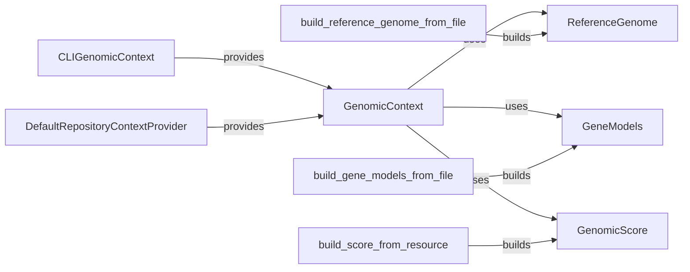

## Component Details

The Genomic Resources Management component is responsible for providing access to and managing genomic resources such as reference genomes, gene models, and genomic scores. It offers functionalities for loading, caching, and querying these resources, which are essential for annotation and variant analysis. The component uses a context to manage the available resources and provides builders to create resource objects from files or other resources.

### ReferenceGenome
Represents a reference genome, providing methods to access chromosome sequences and lengths. It handles loading the genome index and fetching sequence data for specific regions, enabling efficient access to genomic sequence information.
- **Related Classes/Methods**: `gpf.dae.dae.genomic_resources.reference_genome.ReferenceGenome`

### GeneModels
Represents gene models, providing methods to load and access gene structures. It allows building gene models from files or resources and creating regions from genes, facilitating gene-based analysis and annotation.
- **Related Classes/Methods**: `gpf.dae.dae.genomic_resources.gene_models.gene_models.GeneModels`

### GenomicScore
Represents a genomic score, providing methods to access precomputed scores for genomic regions. It handles parsing score definitions, opening and closing score files, and fetching score values for specific regions, enabling score-based analysis and annotation.
- **Related Classes/Methods**: `gpf.dae.dae.genomic_resources.genomic_scores.GenomicScore`

### GenomicContext
Provides a context for accessing genomic resources, including the reference genome, gene models, and genomic scores. It manages the registration and retrieval of these resources, offering a centralized point of access for genomic data.
- **Related Classes/Methods**: `gpf.dae.dae.genomic_resources.genomic_context.GenomicContext`

### build_reference_genome_from_file
Builds a ReferenceGenome object from a file, allowing the creation of reference genome instances from file-based data.
- **Related Classes/Methods**: `gpf.dae.dae.genomic_resources.reference_genome:build_reference_genome_from_file`

### build_gene_models_from_file
Builds a GeneModels object from a file, enabling the creation of gene model instances from file-based data.
- **Related Classes/Methods**: `gpf.dae.dae.genomic_resources.gene_models.gene_models:build_gene_models_from_file`

### build_score_from_resource
Builds a GenomicScore object from a resource, allowing the creation of genomic score instances from resource-based data.
- **Related Classes/Methods**: `gpf.dae.dae.genomic_resources.genomic_scores:build_score_from_resource`

### CLIGenomicContext
A GenomicContext implementation that uses command line arguments to configure genomic resources, providing a way to configure genomic resources through command-line options.
- **Related Classes/Methods**: `gpf.dae.dae.genomic_resources.genomic_context.CLIGenomicContext`

### DefaultRepositoryContextProvider
A provider for GenomicContext that uses a default repository, offering a default way to access genomic resources.
- **Related Classes/Methods**: `gpf.dae.dae.genomic_resources.genomic_context.DefaultRepositoryContextProvider`
