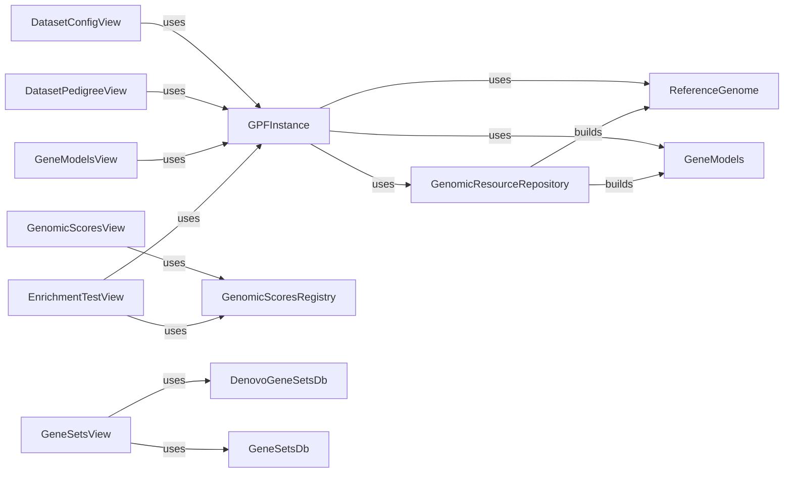

## Component Details

### GenomicResourceRepository
Manages and provides access to genomic resources. It is responsible for building and retrieving resources from different repositories, supporting various storage protocols like local filesystems and cloud-based storage. It uses different protocols to access the resources.
- **Related Classes/Methods**: `dae.genomic_resources.repository_factory.build_genomic_resource_repository`, `dae.genomic_resources.group_repository.GenomicResourceGroupRepo`, `dae.genomic_resources.repository.GenomicResourceRepo`

### ReferenceGenome
Represents a reference genome and provides methods for accessing its sequence. It is built from genomic resources, typically Fasta files, and offers functionalities for sequence retrieval and manipulation.
- **Related Classes/Methods**: `dae.genomic_resources.reference_genome.build_reference_genome_from_resource`, `dae.genomic_resources.reference_genome.ReferenceGenome.open`, `dae.genomic_resources.reference_genome.ReferenceGenome`

### GeneModels
Represents gene models and provides methods for accessing transcript information. It is built from genomic resources and uses different file formats like GFF or GTF to store gene annotations.
- **Related Classes/Methods**: `dae.genomic_resources.gene_models.gene_models.build_gene_models_from_resource`, `dae.genomic_resources.gene_models.gene_models.GeneModels.load`, `dae.genomic_resources.gene_models.gene_models.GeneModels`

### GPFInstance
Represents a GPF instance, providing access to various genomic data and resources, including reference genomes, gene models, and genotype data. It orchestrates the access to the different genomic resources, acting as a central hub for genomic information.
- **Related Classes/Methods**: `dae.gpf_instance.gpf_instance.GPFInstance.build`, `dae.dae.gpf_instance.gpf_instance.GPFInstance`

### GenomicScoresRegistry
Manages genomic scores and provides access to them. It is used by the Genomic Scores View to retrieve and display genomic scores for analysis and visualization.
- **Related Classes/Methods**: `dae.genomic_scores.scores.GenomicScoresRegistry`

### DenovoGeneSetsDb
Manages denovo gene sets, providing functionalities to access and manipulate these gene sets. It is used by the Gene Sets View for displaying and analyzing denovo gene sets.
- **Related Classes/Methods**: `dae.gene_sets.denovo_gene_sets_db.DenovoGeneSetsDb`

### GeneSetsDb
Manages gene sets, offering methods to access and manipulate various gene sets. It is used by the Gene Sets View to provide gene set information for analysis and exploration.
- **Related Classes/Methods**: `dae.gene_sets.gene_sets_db.GeneSetsDb`
