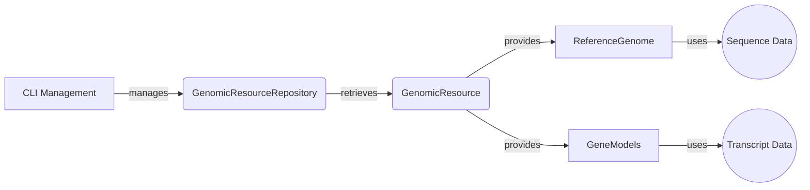

## Genomic Resources Repository (GRR) Overview

The Genomic Resources Repository (GRR) manages the storage and retrieval of genomic resources. It provides an abstraction layer for accessing different types of genomic resources like reference genomes, gene models, and annotation scores. The GRR supports various storage protocols (e.g., local file system, HTTP, S3) and provides a unified interface for accessing resources.

### Data Flow Diagram

### Component Descriptions

*   **CLI Management**
    *   *Purpose*: Provides command-line tools for managing genomic resources, such as listing, importing, and exporting resources. It allows users to interact with the GRR to perform administrative tasks.
    *   *Functionality*: Handles user input, calls GRR functions to manage resources, and displays output to the user.
    *   *Neighbouring Components*: Interacts directly with the `GenomicResourceRepository`.
    *   *Relevant source files*: `dae.genomic_resources.cli.cli_manage`

*   **GenomicResourceRepository**
    *   *Purpose*: Manages access to genomic resources, providing a way to retrieve them. It handles different types of repositories and provides a unified interface for accessing resources.
    *   *Functionality*: Builds and manages different types of repositories, retrieves resources based on ID and version, and handles caching.
    *   *Neighbouring Components*: Interacts with `CLI Management` for administrative tasks and provides resources to `ReferenceGenome` and `GeneModels`.
    *   *Relevant source files*: `dae.genomic_resources.repository_factory.build_genomic_resource_repository`, `dae.genomic_resources.group_repository.GenomicResourceGroupRepo`, `dae.genomic_resources.repository.GenomicResourceRepo`

*   **GenomicResource**
    *   *Purpose*: Represents a single genomic resource, providing access to its metadata and data files.
    *   *Functionality*: Stores metadata about the resource, provides methods for accessing data files, and handles versioning.
    *   *Neighbouring Components*: Used by `GenomicResourceRepository` to manage resources and provides data to `ReferenceGenome` and `GeneModels`.
    *   *Relevant source files*: `dae.genomic_resources.repository.GenomicResource`

*   **ReferenceGenome**
    *   *Purpose*: Provides access to the reference genome sequence. It allows retrieving sequences based on coordinates and provides functionalities for working with the genome.
    *   *Functionality*: Loads the genome index, opens sequence files, and provides methods for fetching sequences.
    *   *Neighbouring Components*: Retrieves sequence data from `SequenceData` and is used by other components needing genome information.
    *   *Relevant source files*: `dae.genomic_resources.reference_genome.ReferenceGenome`

*   **GeneModels**
    *   *Purpose*: Represents gene models, allowing loading and accessing gene information. It provides methods for retrieving gene models based on different criteria.
    *   *Functionality*: Loads gene models from resource files, stores transcript information, and provides methods for querying gene models based on location or gene name.
    *   *Neighbouring Components*: Retrieves transcript data from `TranscriptData` and is used by other components needing gene model information.
    *   *Relevant source files*: `dae.genomic_resources.gene_models.gene_models.GeneModels`
