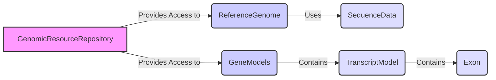

## Genomic Resources Repository Overview

This section provides an overview of the Genomic Resources Repository component, detailing its structure, functionality, and interactions with other components. The repository manages access to essential genomic resources such as reference genomes, gene models, and annotation scores, enabling efficient annotation and analysis.

### Data Flow Diagram

### Component Descriptions

#### 1. GenomicResourceRepository

*   **Description**: Manages genomic resources, providing access to reference genomes and gene models. It uses a hierarchical structure to organize resources and supports different repository types like local files, HTTP, and S3.
*   **Interaction**: Provides access to `ReferenceGenome` and `GeneModels` based on resource identifiers.
*   **Relevant source files**:
    *   `dae.genomic_resources.repository_factory`
    *   `dae.genomic_resources.group_repository.GenomicResourceGroupRepo`

#### 2. ReferenceGenome

*   **Description**: Represents a reference genome, allowing access to sequence information. It manages the loading, indexing, and retrieval of nucleotide sequences for specific chromosome regions.
*   **Interaction**: Fetches sequence data from `SequenceData` based on chromosome and genomic coordinates. Used by other components for sequence retrieval during annotation.
*   **Relevant source files**:
    *   `dae.genomic_resources.reference_genome`

#### 3. GeneModels

*   **Description**: Represents gene models, providing information about gene structures and transcripts. It handles the loading, indexing, and querying of gene models based on gene names or genomic locations.
*   **Interaction**: Provides access to `TranscriptModel` objects based on gene names or genomic locations. Used for gene-based annotation and analysis.
*   **Relevant source files**:
    *   `dae.genomic_resources.gene_models.gene_models`

#### 4. SequenceData

*   **Description**: Represents the raw sequence data of the reference genome.
*   **Interaction**: Provides nucleotide sequence information to `ReferenceGenome`.
*   **Relevant source files**:
    *   `dae.genomic_resources.reference_genome`

#### 5. TranscriptModel

*   **Description**: Represents a transcript model with gene, transcript ID, chromosome, strand, tx, cds and exons.
*   **Interaction**: Part of `GeneModels`, contains `Exon` objects.
*   **Relevant source files**:
    *   `dae.genomic_resources.gene_models.gene_models`

#### 6. Exon

*   **Description**: Represents an exon with its start, stop and frame.
*   **Interaction**: Part of `TranscriptModel`.
*   **Relevant source files**:
    *   `dae.genomic_resources.gene_models.gene_models`