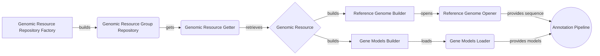

## Genomic Resources Repository Overview

This diagram illustrates the flow of data and interactions between the main components involved in accessing and utilizing genomic resources within the system. The Genomic Resources Repository acts as a central hub, providing access to reference genomes, gene models, and other annotation data.

### Component Descriptions

- **Genomic Resource Repository Factory**
   - *Description*: Responsible for constructing the genomic resource repository from various sources.
   - *Interaction*: Builds the `Genomic Resource Group Repository` based on configuration files or default settings.
   - *Relevant source files*: `dae.genomic_resources.repository_factory`

- **Genomic Resource Group Repository**
   - *Description*: Manages a collection of genomic resources, organizing them into groups and providing access to individual resources.
   - *Interaction*: Uses `Genomic Resource Getter` to retrieve specific resources.
   - *Relevant source files*: `dae.genomic_resources.group_repository.GenomicResourceGroupRepo`

- **Genomic Resource Getter**
   - *Description*: Retrieves a specific genomic resource from the repository.
   - *Interaction*: Locates and returns the requested `Genomic Resource`.
   - *Relevant source files*: `dae.genomic_resources.group_repository.GenomicResourceGroupRepo.get_resource`

- **Genomic Resource**
   - *Description*: Represents a single genomic resource, such as a reference genome or gene model.
   - *Interaction*: Used by `Reference Genome Builder` and `Gene Models Builder` to create specific data structures.
   - *Relevant source files*: `dae.genomic_resources.repository.GenomicResource`

- **Reference Genome Builder**
   - *Description*: Constructs a reference genome from a genomic resource (FASTA file).
   - *Interaction*: Builds the `Reference Genome Opener` to provide access to the genome sequence.
   - *Relevant source files*: `dae.genomic_resources.reference_genome.build_reference_genome_from_resource`

- **Gene Models Builder**
   - *Description*: Constructs gene models from a genomic resource (GFF/GTF file).
   - *Interaction*: Builds the `Gene Models Loader` to load the gene models data.
   - *Relevant source files*: `dae.genomic_resources.gene_models.gene_models.build_gene_models_from_resource`

- **Reference Genome Opener**
   - *Description*: Provides access to the reference genome sequence.
   - *Interaction*: Provides sequence data to the `Annotation Pipeline`.
   - *Relevant source files*: `dae.genomic_resources.reference_genome.ReferenceGenome.open`

- **Gene Models Loader**
   - *Description*: Loads gene models data into a usable format.
   - *Interaction*: Provides gene models to the `Annotation Pipeline`.
   - *Relevant source files*: `dae.genomic_resources.gene_models.gene_models.GeneModels.load`

- **Annotation Pipeline**
   - *Description*: Uses genomic resources to annotate variants.
   - *Interaction*: Retrieves reference genome sequences from `Reference Genome Opener` and gene models from `Gene Models Loader`.
   - *Relevant source files*: N/A (external component)
