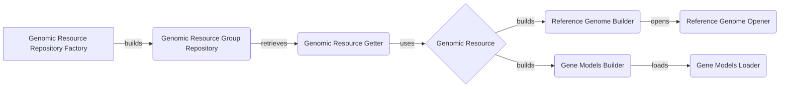

### Component Descriptions:

**1. Genomic Resource Repository Factory**
   - **Purpose:** Creates and configures genomic resource repositories based on provided configurations.
   - **Functionality:** Reads configuration files, instantiates appropriate repository types (e.g., local, HTTP), and initializes the repository with available resources.
   - **Interaction:** Builds `Genomic Resource Group Repository`.
   - **Relevant source files:** `dae.genomic_resources.repository_factory`

**2. Genomic Resource Group Repository**
   - **Purpose:** Manages a collection of genomic resource groups, providing an interface to access and organize resources.
   - **Functionality:** Stores genomic resources in groups, allowing for structured access and management. Implements methods for retrieving resources by ID or path.
   - **Interaction:** Retrieves resources via `Genomic Resource Getter`.
   - **Relevant source files:** `dae.genomic_resources.group_repository.GenomicResourceGroupRepo`

**3. Genomic Resource Getter**
   - **Purpose:** Retrieves a specific genomic resource from the repository.
   - **Functionality:** Locates and returns a genomic resource based on its ID or path within the repository. Handles resource versioning and dependencies.
   - **Interaction:** Uses `Genomic Resource` to build `Reference Genome` and `Gene Models`.
   - **Relevant source files:** `dae.genomic_resources.group_repository.GenomicResourceGroupRepo.get_resource`

**4. Genomic Resource**
   - **Purpose:** Abstract representation of a genomic resource.
   - **Functionality:** Provides a common interface for accessing resource metadata, data files, and dependencies. Serves as a base class for specific resource types (e.g., reference genome, gene models).
   - **Interaction:** Builds `Reference Genome Builder` and `Gene Models Builder`.
   - **Relevant source files:** N/A (Abstract)

**5. Reference Genome Builder**
   - **Purpose:** Constructs a reference genome object from a genomic resource.
   - **Functionality:** Reads genome sequence data from resource files (e.g., FASTA), builds an in-memory representation of the genome, and provides methods for sequence retrieval.
   - **Interaction:** Opens `Reference Genome Opener`.
   - **Relevant source files:** `dae.genomic_resources.reference_genome.build_reference_genome_from_resource`

**6. Gene Models Builder**
   - **Purpose:** Creates gene models from a genomic resource.
   - **Functionality:** Parses gene annotation files (e.g., GFF, GTF), builds a data structure representing gene structures (exons, introns, transcripts), and provides methods for querying gene models.
   - **Interaction:** Loads data via `Gene Models Loader`.
   - **Relevant source files:** `dae.genomic_resources.gene_models.gene_models.build_gene_models_from_resource`

**7. Reference Genome Opener**
   - **Purpose:** Opens and provides access to the reference genome.
   - **Functionality:** Loads the reference genome data and provides methods for accessing sequence information.
   - **Interaction:** N/A
   - **Relevant source files:** `dae.genomic_resources.reference_genome.ReferenceGenome.open`

**8. Gene Models Loader**
   - **Purpose:** Loads gene models data.
   - **Functionality:** Loads gene models data from the specified resource.
   - **Interaction:** N/A
   - **Relevant source files:** `dae.genomic_resources.gene_models.gene_models.GeneModels.load`