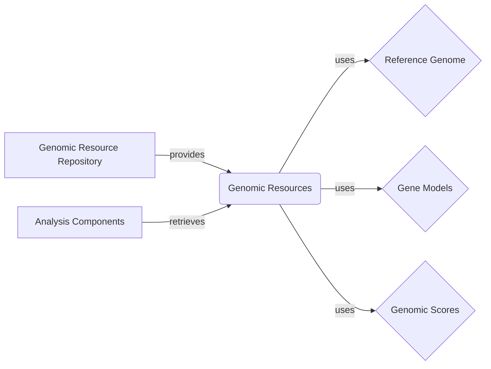

## Genomic Resources Component Overview

The `Genomic Resources` component is central to managing and providing access to various genomic data, such as reference genomes, gene models, and annotation scores. It abstracts the underlying storage and retrieval mechanisms, offering a consistent interface for other components to utilize these resources.

### Data Flow Diagram

### Component Descriptions

*   **Genomic Resource Repository:** Manages access to genomic resources. It builds, retrieves, and manages resources within a repository, supporting different repository types. It provides the resources to the `Genomic Resources` component.
    *   Relevant source files: `dae.genomic_resources.repository_factory`, `dae.genomic_resources.group_repository`, `dae.genomic_resources.repository`
*   **Genomic Resources:** Acts as a central point for accessing different genomic resources. It uses the `Reference Genome`, `Gene Models`, and `Genomic Scores` components to provide a unified interface for retrieving genomic data. It is retrieved by `Analysis Components`.
    *   Relevant source files: `dae.genomic_resources`, `dae.genomic_resources.resource`, `dae.genomic_resources.repository`
*   **Reference Genome:** Represents the reference genome and provides methods to open, access, and query sequence data. It is used by the `Genomic Resources` component to provide sequence information.
    *   Relevant source files: `dae.genomic_resources.reference_genome`
*   **Gene Models:** Represents gene models and provides methods to load, access, and query gene annotations. It is used by the `Genomic Resources` component to provide gene annotation information.
    *   Relevant source files: `dae.genomic_resources.gene_models`
*   **Genomic Scores:** Handles genomic scores, providing functionalities to load, access, and query scores associated with genomic positions or regions. It is used by the `Genomic Resources` component to provide score information.
    *   Relevant source files: `dae.genomic_scores`
*   **Analysis Components:** These are external components that perform genomic analysis and require access to genomic resources. They retrieve the resources from the `Genomic Resources` component.
