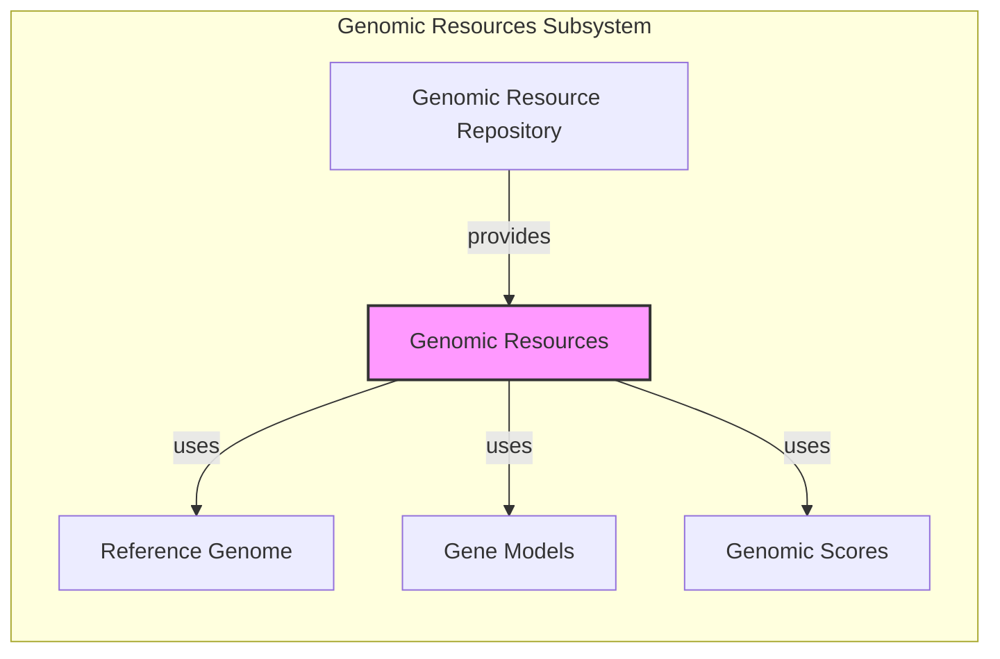
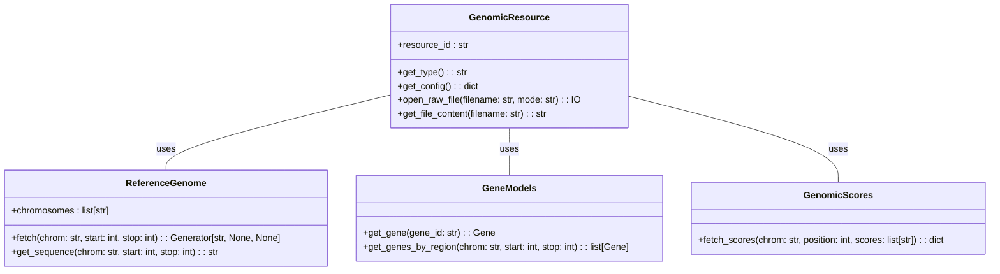

### Components Description:

*   **Genomic Resource Repository (GRR):** Manages access to genomic resources. It provides methods to build, retrieve, and manage resources within a defined storage location. It `provides` resources to the `Genomic Resources` component.
    *   Relevant source files: `dae.genomic_resources.repository_factory`, `dae.genomic_resources.group_repository`

*   **Genomic Resources (GR):** Serves as a central access point for various genomic data. It `uses` `Reference Genome`, `Gene Models`, and `Genomic Scores` to provide a unified interface for accessing genomic information.
    *   Relevant source files: `dae.genomic_resources`

*   **Reference Genome (RG):** Represents the reference genome and provides methods to open, access, and query sequence data for specific regions or positions. `Genomic Resources` `uses` this component to retrieve sequence information.
    *   Relevant source files: `dae.genomic_resources.reference_genome`

*   **Gene Models (GM):** Represents gene models and provides methods to load, access, and query gene structures, including exons, transcripts, and coding regions. `Genomic Resources` `uses` this component to access gene annotations.
    *   Relevant source files: `dae.genomic_resources.gene_models`

*   **Genomic Scores (GS):** Component responsible for managing, accessing, and querying genomic scores, such as conservation scores or functional predictions, associated with genomic positions or regions. `Genomic Resources` `uses` this component to access precomputed scores.
    *   Relevant source files: `dae.genomic_scores`
