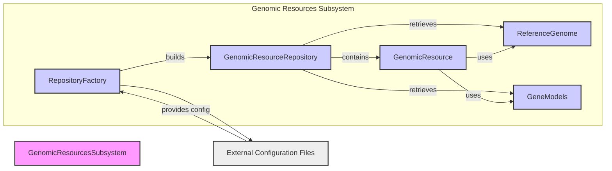

## Genomic Resources Component Overview

This component handles the storage, retrieval, and management of genomic resources. It provides a unified interface for accessing diverse genomic data sources.

**Data Flow Diagram**

**Component Descriptions**

*   **Repository Factory**
    *   *Description*: Creates and configures `GenomicResourceRepository` instances based on external configuration files. It abstracts the repository creation process.
    *   *Functionality*: Reads configuration files, determines the repository type (e.g., file system, HTTP), and instantiates the appropriate repository class.
    *   *Interaction*: Reads configuration from `ExternalConfig` and builds `GenomicResourceRepository`.
    *   *Source Files*: `dae.genomic_resources.repository_factory.py`

*   **Genomic Resource Repository**
    *   *Description*: Manages a collection of `GenomicResource` instances. It provides methods for accessing and retrieving resources.
    *   *Functionality*: Stores and indexes genomic resources, handles different repository types (e.g., file system, HTTP), and provides search and retrieval methods.
    *   *Interaction*: Built by `RepositoryFactory`, contains `GenomicResource`, and retrieves `ReferenceGenome` and `GeneModels`.
    *   *Source Files*: `dae.genomic_resources.repository.py`, `dae.genomic_resources.group_repository.py`

*   **Genomic Resource**
    *   *Description*: Represents a single genomic resource, such as a reference genome or gene model. It provides access to the resource's metadata and data.
    *   *Functionality*: Encapsulates the resource's configuration, provides methods for accessing data files, and manages resource dependencies.
    *   *Interaction*: Contained within `GenomicResourceRepository`, uses `ReferenceGenome` and `GeneModels` to access genomic data.
    *   *Source Files*: `dae.genomic_resources.genomic_resource.py`

*   **Reference Genome**
    *   *Description*: Provides access to reference genome sequences.
    *   *Functionality*: Loads genome sequence data, provides methods for retrieving sequences by coordinates, and handles chromosome indexing.
    *   *Interaction*: Retrieved by `GenomicResourceRepository` and used by `GenomicResource`.
    *   *Source Files*: `dae.genomic_resources.reference_genome.py`

*   **Gene Models**
    *   *Description*: Provides access to gene model annotations.
    *   *Functionality*: Loads gene model data, provides methods for retrieving gene structures (transcripts, exons) by name or coordinates.
    *   *Interaction*: Retrieved by `GenomicResourceRepository` and used by `GenomicResource`.
    *   *Source Files*: `dae.genomic_resources.gene_models.gene_models.py`
