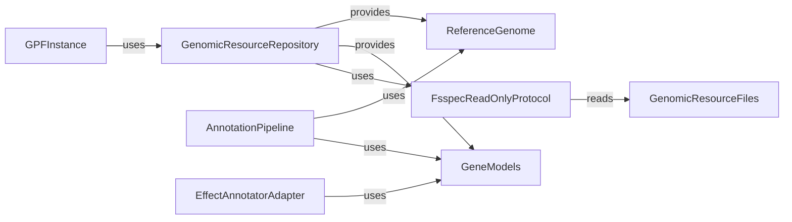

## Genomic Resources Overview

This section provides an overview of the Genomic Resources component, which manages access to genomic resources like reference genomes and gene models within the GPF framework.

### Data Flow Diagram

### Component Descriptions

*   **GPFInstance**: The central GPF instance that orchestrates access to various components, including the Genomic Resources.
    *   Purpose: Manages the overall GPF environment and provides access to configured resources.
    *   Interaction: Initializes and uses the `GenomicResourceRepository` to access genomic data.
    *   Relevant source files: `dae/gpf_instance/gpf_instance.py`

*   **GenomicResourceRepository**: Manages a collection of genomic resources, providing a unified interface for accessing them.
    *   Purpose: Acts as a central point for accessing and managing genomic resources like reference genomes and gene models.
    *   Interaction: Provides `ReferenceGenome` and `GeneModels` to other components like `AnnotationPipeline` and `EffectAnnotatorAdapter`.
    *   Relevant source files: `dae/genomic_resources/repository.py`, `dae/genomic_resources/repository_factory.py`, `dae/genomic_resources/group_repository.py`, `dae/genomic_resources/cached_repository.py`

*   **ReferenceGenome**: Represents the reference genome sequence.
    *   Purpose: Provides access to the reference genome sequence for annotation and other genomic analyses.
    *   Interaction: Used by `AnnotationPipeline` to retrieve reference sequence information during variant annotation.
    *   Relevant source files: `dae/genomic_resources/reference_genome.py`

*   **GeneModels**: Represents gene models and transcript structures.
    *   Purpose: Provides information about gene structure, transcripts, and exons for variant effect annotation.
    *   Interaction: Used by `AnnotationPipeline` and `EffectAnnotatorAdapter` to determine the effects of variants on genes and transcripts.
    *   Relevant source files: `dae/genomic_resources/gene_models/gene_models.py`, `dae/genomic_resources/gene_models/parsing.py`

*   **FsspecReadOnlyProtocol**: Provides read-only access to genomic resource files using the fsspec library.
    *   Purpose: Enables access to genomic resource files stored in various locations (e.g., local filesystem, cloud storage).
    *   Interaction: Used by `GenomicResourceRepository` to read resource files.
    *   Relevant source files: `dae/genomic_resources/fsspec_protocol.py`

*   **GenomicResourceFiles**: Represents the actual genomic resource files.
    *   Purpose: Storage abstraction for the genomic resources.
    *   Interaction: Read by `FsspecReadOnlyProtocol` to access the data.
    *   Relevant source files: N/A

*   **AnnotationPipeline**: Annotates genetic variants.
    *   Purpose: Uses genomic resources like `ReferenceGenome` and `GeneModels` to add annotations to variants.
    *   Interaction: Uses `ReferenceGenome` and `GeneModels` to annotate variants.
    *   Relevant source files: `dae/annotation/annotation_pipeline.py`

*   **EffectAnnotatorAdapter**: Adapts the effect annotation process.
    *   Purpose: Uses `GeneModels` to determine the effects of variants on genes and transcripts.
    *   Interaction: Uses `GeneModels` to annotate variant effects.
    *   Relevant source files: `dae/annotation/effect_annotator.py`
