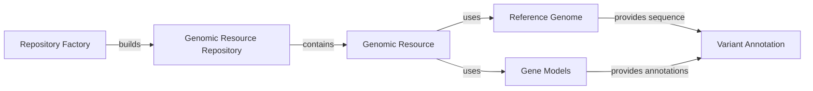

```markdown
## Genomic Resources Component Overview

This component manages access to genomic resources like reference genomes and gene models. It builds repositories and provides access to individual resources.

Here's a data flow diagram illustrating the interaction between the main components:



### Component Descriptions:

*   **Repository Factory**
    *Description*: Responsible for building and configuring different types of genomic resource repositories based on a configuration.
    *Functionality*: Reads repository definitions (from YAML files or default configurations) and instantiates the appropriate repository type (e.g., `GenomicResourceGroupRepo`, `GenomicResourceProtocolRepo`).
    *Interaction*: Builds `Genomic Resource Repository`.
    *Relevant source files*: `dae.genomic_resources.repository_factory`

*   **Genomic Resource Repository**
    *Description*: Manages a collection of genomic resources, providing a unified interface for accessing them.
    *Functionality*: Abstracts the underlying storage and retrieval mechanisms, allowing access to resources stored locally or remotely. It supports different repository types, including group repositories that aggregate multiple repositories.
    *Interaction*: Contains `Genomic Resource` and is built by `Repository Factory`.
    *Relevant source files*: `dae.genomic_resources.repository`, `dae.genomic_resources.group_repository`

*   **Genomic Resource**
    *Description*: Represents a single genomic resource, providing metadata and access to the underlying data.
    *Functionality*: Defines the basic interface for all genomic resources, including methods for accessing files, metadata, and other resource-specific information.
    *Interaction*: Used by `Reference Genome` and `Gene Models`. It is contained in `Genomic Resource Repository`.
    *Relevant source files*: `dae.genomic_resources.genomic_resource`

*   **Reference Genome**
    *Description*: Represents a reference genome and provides methods for accessing sequence information.
    *Functionality*: Loads genome indices, retrieves chromosome lengths, and fetches nucleotide sequences for specified regions. It supports different genome formats and provides efficient sequence retrieval.
    *Interaction*: Provides sequence information to `Variant Annotation`. Uses `Genomic Resource` to access the sequence data.
    *Relevant source files*: `dae.genomic_resources.reference_genome`

*   **Gene Models**
    *Description*: Represents gene models and provides methods for loading and accessing gene annotations.
    *Functionality*: Loads gene models from various file formats, stores transcript information, and provides methods for querying gene structures based on genomic coordinates. It handles different gene model formats and provides a consistent interface for accessing gene structures.
    *Interaction*: Provides gene annotations to `Variant Annotation`. Uses `Genomic Resource` to load gene model data.
    *Relevant source files*: `dae.genomic_resources.gene_models.gene_models`

*   **Variant Annotation**
    *Description*: Uses genomic resources to annotate genetic variants.
    *Functionality*: This component takes variant data and uses the `Reference Genome` and `Gene Models` to add information about the variant's location, potential impact on genes, and other relevant annotations.
    *Interaction*: Receives sequence information from `Reference Genome` and gene annotations from `Gene Models`.
    *Relevant source files*: N/A (This component is external to the Genomic Resources subsystem but interacts with it.)
```