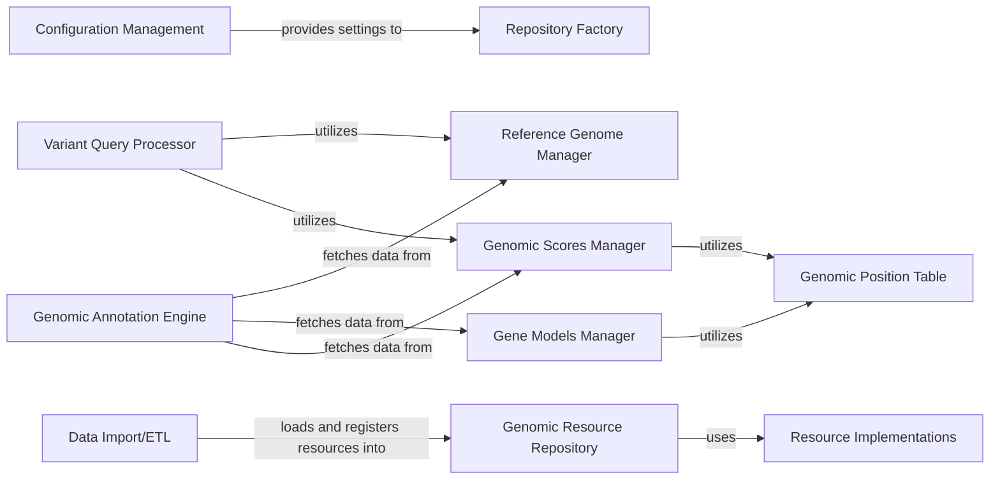

## Details

The Genomic Resources Management component is fundamental to the DAE project, serving as the central hub for all genomic data. It aligns with the "Data Lake / Data Warehouse" and "Modular Monolith" architectural patterns by providing a unified and organized access layer for diverse genomic resources. Its importance stems from the fact that all downstream bioinformatics analyses, such as variant annotation and query processing, rely heavily on accurate and efficiently accessible genomic context data.

### Genomic Resource Repository
This is the core component responsible for managing and providing access to all genomic resources. It acts as a central registry, allowing other components to discover and retrieve specific resources (e.g., reference genomes, gene models, genomic scores) based on their IDs and versions. It abstracts the underlying storage mechanisms.

**Related Classes/Methods**:

- <a href="https://github.com/iossifovlab/gpf/dae/dae/genomic_resources/repository.py#L1-L1" target="_blank" rel="noopener noreferrer">`dae.genomic_resources.repository` (1:1)</a>

### Repository Factory
This component is responsible for creating and configuring instances of genomic resource repositories. It allows for flexible creation of different repository types (e.g., local, remote, cached) based on configuration settings, promoting extensibility and adaptability to various deployment environments.

**Related Classes/Methods**:

- <a href="https://github.com/iossifovlab/gpf/dae/dae/genomic_resources/repository_factory.py#L1-L1" target="_blank" rel="noopener noreferrer">`dae.genomic_resources.repository_factory` (1:1)</a>

### Reference Genome Manager
Manages the loading, caching, and retrieval of reference genome sequences. It provides an interface to access specific genomic regions and ensures efficient access to this crucial data for alignment and variant calling.

**Related Classes/Methods**:

- <a href="https://github.com/iossifovlab/gpf/dae/dae/genomic_resources/reference_genome.py#L1-L1" target="_blank" rel="noopener noreferrer">`dae.genomic_resources.reference_genome` (1:1)</a>

### Gene Models Manager
Handles the parsing, storage, and retrieval of gene models, which define the structure of genes (exons, introns, transcripts). It provides methods to query gene information, such as gene names, locations, and transcript variants.

**Related Classes/Methods**:

- <a href="https://github.com/iossifovlab/gpf/dae/dae/genomic_resources/gene_models/gene_models.py#L1-L1" target="_blank" rel="noopener noreferrer">`dae.genomic_resources.gene_models.gene_models` (1:1)</a>

### Genomic Scores Manager
Manages the loading and access to various genomic scores (e.g., conservation scores, pathogenicity predictions). It provides an interface to query scores for specific genomic positions, which are critical for variant prioritization and interpretation.

**Related Classes/Methods**:

- <a href="https://github.com/iossifovlab/gpf/dae/dae/genomic_resources/genomic_scores.py#L1-L1" target="_blank" rel="noopener noreferrer">`dae.genomic_resources.genomic_scores` (1:1)</a>

### Genomic Position Table
Provides an abstract interface for handling tabular genomic data, such as genomic scores or other position-specific annotations. It supports various underlying file formats (e.g., BigWig, Tabix) through its implementations.

**Related Classes/Methods**:

- <a href="https://github.com/iossifovlab/gpf/dae/dae/genomic_resources/genomic_position_table/table.py#L1-L1" target="_blank" rel="noopener noreferrer">`dae.genomic_resources.genomic_position_table.table` (1:1)</a>

### Resource Implementations
This package contains concrete implementations for various genomic resource types, such as annotation_pipeline_impl.py, gene_models_impl.py, genomic_scores_impl.py, liftover_chain_impl.py, and reference_genome_impl.py. These modules provide the specific logic for how each type of genomic resource is loaded, processed, and accessed.

**Related Classes/Methods**:

- `dae.genomic_resources.implementations` (1:1)
- <a href="https://github.com/iossifovlab/gpf/dae/dae/genomic_resources/implementations/annotation_pipeline_impl.py#L1-L1" target="_blank" rel="noopener noreferrer">`dae.genomic_resources.implementations.annotation_pipeline_impl` (1:1)</a>
- <a href="https://github.com/iossifovlab/gpf/dae/dae/genomic_resources/implementations/gene_models_impl.py#L1-L1" target="_blank" rel="noopener noreferrer">`dae.genomic_resources.implementations.gene_models_impl` (1:1)</a>
- <a href="https://github.com/iossifovlab/gpf/dae/dae/genomic_resources/implementations/genomic_scores_impl.py#L1-L1" target="_blank" rel="noopener noreferrer">`dae.genomic_resources.implementations.genomic_scores_impl` (1:1)</a>
- <a href="https://github.com/iossifovlab/gpf/dae/dae/genomic_resources/implementations/liftover_chain_impl.py#L1-L1" target="_blank" rel="noopener noreferrer">`dae.genomic_resources.implementations.liftover_chain_impl` (1:1)</a>
- <a href="https://github.com/iossifovlab/gpf/dae/dae/genomic_resources/implementations/reference_genome_impl.py#L1-L1" target="_blank" rel="noopener noreferrer">`dae.genomic_resources.implementations.reference_genome_impl` (1:1)</a>

### Genomic Annotation Engine
Component responsible for annotating genomic data.

**Related Classes/Methods**: _None_

### Variant Query Processor
Component responsible for processing and querying genomic variants.

**Related Classes/Methods**: _None_

### Data Import/ETL
Component responsible for importing and transforming data.

**Related Classes/Methods**: _None_

### Configuration Management [[Expand]](./Configuration_Management.md)
Component responsible for managing system configurations.

**Related Classes/Methods**: _None_

### [FAQ](https://github.com/CodeBoarding/GeneratedOnBoardings/tree/main?tab=readme-ov-file#faq)