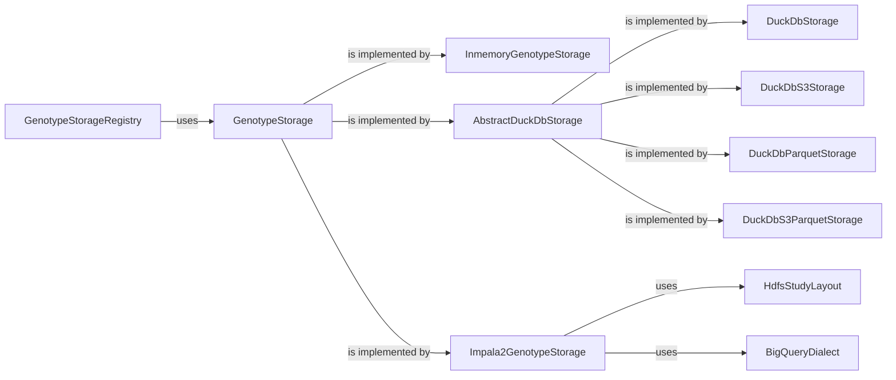

### Component Overview: Genotype Storage Abstraction

This document describes the architecture of the Genotype Storage Abstraction component within the GPF project. This component provides a unified interface for accessing variant data stored in different storage backends.

**Data Flow Diagram**

**Component Descriptions**

*   **GenotypeStorageRegistry**
    *Description:* Registry for genotype storages. It manages the available genotype storage instances. It accepts genotype storage configurations, instantiates the storages, and registers them for later use.
    *   *Interaction:* Uses `GenotypeStorage` to register and retrieve storage instances.
    *   *Source Files:* `dae.genotype_storage.genotype_storage.GenotypeStorageRegistry`

*   **GenotypeStorage**
    *Description:* Abstract base class for all genotype storage implementations. It defines the common interface for accessing variant data.
    *   *Interaction:* Implemented by concrete storage classes like `InmemoryGenotypeStorage`, `AbstractDuckDbStorage`, and `Impala2GenotypeStorage`.
    *   *Source Files:* `dae.genotype_storage.genotype_storage.GenotypeStorage`

*   **InmemoryGenotypeStorage**
    *Description:* A genotype storage that keeps data in memory. Useful for testing and small datasets.
    *   *Interaction:* Implements the `GenotypeStorage` interface.
    *   *Source Files:* `dae.inmemory_storage.inmemory_genotype_storage.InmemoryGenotypeStorage`

*   **AbstractDuckDbStorage**
    *Description:* Defines abstract DuckDb genotype storage. It inherits from GenotypeStorage and DuckDbConnectionFactory.
    *   *Interaction:* Implements the `GenotypeStorage` interface and provides common functionality for DuckDB-based storages.
    *   *Source Files:* `dae.duckdb_storage.duckdb_genotype_storage.AbstractDuckDbStorage`

*   **DuckDbStorage**
    *Description:* A genotype storage that uses a local DuckDB database.
    *   *Interaction:* Extends `AbstractDuckDbStorage` and connects to a DuckDB database file.
    *   *Source Files:* `dae.duckdb_storage.duckdb_genotype_storage.DuckDbStorage`

*   **DuckDbS3Storage**
    *Description:* A genotype storage that uses a DuckDB database stored in S3.
    *   *Interaction:* Extends `AbstractDuckDbStorage` and connects to a DuckDB database file in an S3 bucket.
    *   *Source Files:* `dae.duckdb_storage.duckdb_genotype_storage.DuckDbS3Storage`

*   **DuckDbParquetStorage**
    *Description:* A genotype storage that uses Parquet files stored locally and accessed through DuckDB.
    *   *Interaction:* Extends `AbstractDuckDbStorage` and reads Parquet files using DuckDB.
    *   *Source Files:* `dae.duckdb_storage.duckdb_genotype_storage.DuckDbParquetStorage`

*   **DuckDbS3ParquetStorage**
    *Description:* A genotype storage that uses Parquet files stored in S3 and accessed through DuckDB.
    *   *Interaction:* Extends `AbstractDuckDbStorage` and reads Parquet files from an S3 bucket using DuckDB.
    *   *Source Files:* `dae.duckdb_storage.duckdb_genotype_storage.DuckDbS3ParquetStorage`

*   **Impala2GenotypeStorage**
    *Description:* A genotype storage that uses Impala to query data stored in HDFS.
    *   *Interaction:* Implements the `GenotypeStorage` interface and interacts with Impala.
    *   *Source Files:* `impala2_storage.schema2.impala2_genotype_storage.Impala2GenotypeStorage`

*   **HdfsStudyLayout**
    *Description:* Layout of a study in HDFS. Contains paths to pedigree, summary variants, family variants, meta files and samples.
    *   *Interaction:* Used by `Impala2GenotypeStorage` to locate data files in HDFS.
    *   *Source Files:* `impala2_storage.schema2.impala2_genotype_storage.HdfsStudyLayout`

*   **BigQueryDialect**
    *Description:* Abstracts away details related to bigquery. It inherits from Dialect.
    *   *Interaction:* Used by `Impala2GenotypeStorage` to generate BigQuery-compatible SQL queries.
    *   *Source Files:* `gcp_storage.bigquery_variants.BigQueryDialect`
