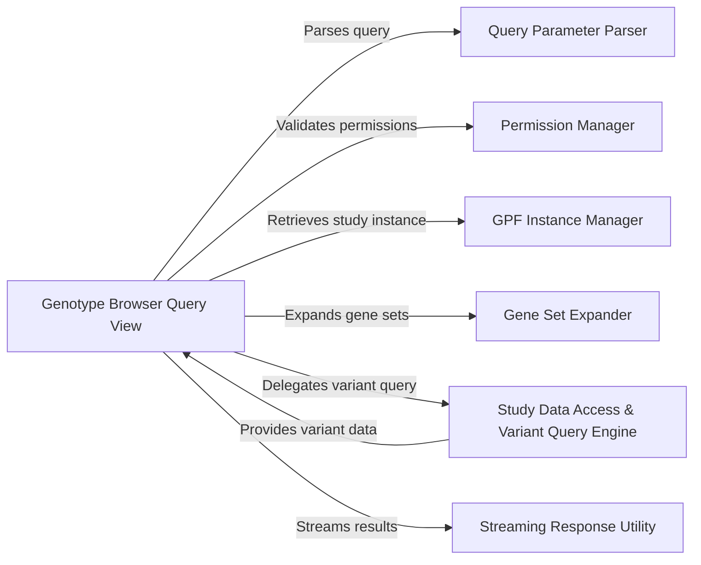

## Component Details

This analysis details the components and their relationships within the GenotypeBrowserQueryView subsystem, which orchestrates genotype browsing queries from the web interface, including parsing requests, validating permissions, accessing genomic data, and streaming results.

### Genotype Browser Query View
This is the primary entry point for genotype browsing queries from the web interface. It orchestrates the entire query processing pipeline, from parsing initial requests and validating user permissions to dispatching queries to the appropriate data sources and streaming results back to the client. It acts as a central coordinator, ensuring that all necessary pre-processing and data retrieval steps are executed correctly.

**Related Classes/Methods**:

- `Genotype Browser Query View` (1:1)

### Query Parameter Parser
Responsible for robustly parsing and normalizing raw HTTP query parameters into a structured and consistent format (Python dictionary). This component handles various input types and ensures that the data is ready for subsequent validation and processing, preventing malformed queries from propagating through the system.

**Related Classes/Methods**:

- `Query Parameter Parser` (1:1)

### Permission Manager
Enforces access control policies for datasets and studies. It verifies if the authenticated user has the necessary permissions to access the requested data. It also handles scenarios of partial permissions, filtering the accessible studies within a dataset to ensure data security and compliance.

**Related Classes/Methods**:

- `Permission Manager` (1:1)

### GPF Instance Manager
Provides a singleton instance of the Genomic Platform Framework (GPF), which serves as the central registry for all loaded genomic studies and their associated data. This component is crucial for dynamically retrieving the correct WDAEStudy wrapper based on a given dataset ID, enabling access to the underlying genomic data.

**Related Classes/Methods**:

- `GPF Instance Manager` (1:1)

### Gene Set Expander
Translates high-level gene set identifiers or individual gene symbols provided in the query into a comprehensive list of gene symbols. This expansion is vital for accurately filtering variants based on genetic regions of interest.

**Related Classes/Methods**:

- `Gene Set Expander` (1:1)

### Study Data Access & Variant Query Engine
This component encapsulates the logic for interacting with a specific genomic study (dataset). It translates the processed query parameters into optimized queries for the underlying genotype data storage and efficiently retrieves variant data. It acts as the direct interface to the genomic data backend.

**Related Classes/Methods**:

- `Study Data Access & Variant Query Engine` (1:1)

### Streaming Response Utility
Manages the efficient streaming of large query results (variants) back to the client as a JSON stream. This prevents memory exhaustion on the server for extensive datasets and improves the responsiveness of the web interface by allowing incremental data rendering.

**Related Classes/Methods**:

- `Streaming Response Utility` (1:1)

### [FAQ](https://github.com/CodeBoarding/GeneratedOnBoardings/tree/main?tab=readme-ov-file#faq)