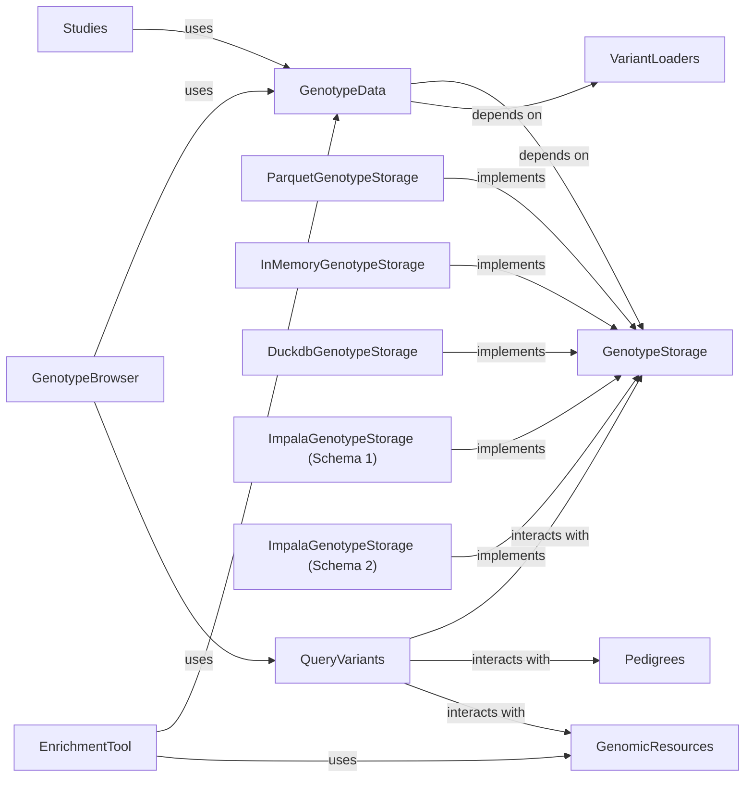

## Component Details

The `GenotypeData` component represents the raw genotype data within the GPF (Genomic Paternity Finder) system. It serves as the fundamental source of genetic information, providing the underlying data structures and methods necessary for variant retrieval and analysis. Its core purpose is to abstract the complexities of various genotype storage mechanisms, offering a unified interface for accessing and manipulating genetic data.

### GenotypeData
The raw genotype data within the GPF (Genomic Paternity Finder) system. It serves as the fundamental source of genetic information, providing the underlying data structures and methods necessary for variant retrieval and analysis. Its core purpose is to abstract the complexities of various genotype storage mechanisms, offering a unified interface for accessing and manipulating genetic data.

**Related Classes/Methods**: _None_

### GenotypeStorage
This is the abstract base class that defines the interface for all genotype storage backends. It specifies the common methods for querying and retrieving genotype data, ensuring that different storage implementations can be used interchangeably.

**Related Classes/Methods**:

- <a href="https://github.com/iossifovlab/gpf/blob/master/dae/dae/genotype_storage/genotype_storage.py#L13-L80" target="_blank" rel="noopener noreferrer">`gpf.dae.dae.genotype_storage.genotype_storage.GenotypeStorage` (13:80)</a>

### VariantLoaders
This component is responsible for loading raw variant data from various file formats (e.g., VCF, DAE, Parquet, CNV) into a standardized internal representation. It acts as an ingestion layer for genetic information.

**Related Classes/Methods**:

- `gpf.dae.dae.variants_loaders` (0:0)

### ParquetGenotypeStorage
A concrete implementation of `GenotypeStorage` that stores and retrieves genotype data using the Parquet file format, optimized for columnar storage and efficient querying.

**Related Classes/Methods**:

- <a href="https://github.com/iossifovlab/gpf/blob/master/dae/dae/parquet_storage/storage.py#L160-L230" target="_blank" rel="noopener noreferrer">`gpf.dae.dae.parquet_storage.storage.ParquetGenotypeStorage` (160:230)</a>

### InMemoryGenotypeStorage
A concrete implementation of `GenotypeStorage` that holds genotype data in memory, suitable for smaller datasets or testing purposes where fast access is paramount.

**Related Classes/Methods**:

- <a href="https://github.com/iossifovlab/gpf/blob/master/dae/dae/inmemory_storage/inmemory_genotype_storage.py#L0-L0" target="_blank" rel="noopener noreferrer">`gpf.dae.dae.inmemory_storage.inmemory_genotype_storage.InMemoryGenotypeStorage` (0:0)</a>

### DuckdbGenotypeStorage
A concrete implementation of `GenotypeStorage` that leverages DuckDB, an in-process SQL OLAP database management system, for storing and querying genotype data.

**Related Classes/Methods**:

- <a href="https://github.com/iossifovlab/gpf/blob/master/dae/dae/duckdb_storage/duckdb_genotype_storage.py#L0-L0" target="_blank" rel="noopener noreferrer">`gpf.dae.dae.duckdb_storage.duckdb_genotype_storage.DuckdbGenotypeStorage` (0:0)</a>

### ImpalaGenotypeStorage (Schema 1)
An implementation of `GenotypeStorage` that interacts with Impala, a massively parallel processing (MPP) SQL query engine, for large-scale genotype data storage and retrieval, using schema 1.

**Related Classes/Methods**:

- <a href="https://github.com/iossifovlab/gpf/blob/master/impala_storage/impala_storage/schema1/impala_genotype_storage.py#L28-L479" target="_blank" rel="noopener noreferrer">`gpf.impala_storage.impala_storage.schema1.impala_genotype_storage.ImpalaGenotypeStorage` (28:479)</a>

### ImpalaGenotypeStorage (Schema 2)
An implementation of `GenotypeStorage` that interacts with Impala, a massively parallel processing (MPP) SQL query engine, for large-scale genotype data storage and retrieval, using schema 2.

**Related Classes/Methods**:

- <a href="https://github.com/iossifovlab/gpf/blob/master/impala2_storage/impala2_storage/schema2/impala2_genotype_storage.py#L0-L0" target="_blank" rel="noopener noreferrer">`gpf.impala2_storage.impala2_storage.schema2.impala2_genotype_storage.ImpalaGenotypeStorage` (0:0)</a>

### QueryVariants
This component is responsible for processing and executing queries against the `GenotypeData` to retrieve specific variants based on various criteria (e.g., genomic region, gene, variant type).

**Related Classes/Methods**:

- `gpf.dae.dae.query_variants` (0:0)

### Pedigrees
Manages and provides access to pedigree information associated with the individuals in a study. Pedigree data is crucial for understanding family relationships and inheritance patterns of variants.

**Related Classes/Methods**:

- `gpf.dae.dae.pedigrees` (0:0)

### GenomicResources
Handles the management and access to various genomic annotation resources (e.g., gene models, genomic scores, conservation scores). These resources are used to enrich and interpret raw genotype data.

**Related Classes/Methods**:

- `gpf.dae.dae.genomic_resources` (0:0)

### Studies
Represents collections of genotype and phenotype data.

**Related Classes/Methods**: _None_

### GenotypeBrowser
A user interface component for displaying and exploring genetic variants.

**Related Classes/Methods**: _None_

### EnrichmentTool
A tool for statistical analysis of variant sets.

**Related Classes/Methods**: _None_

### [FAQ](https://github.com/CodeBoarding/GeneratedOnBoardings/tree/main?tab=readme-ov-file#faq)