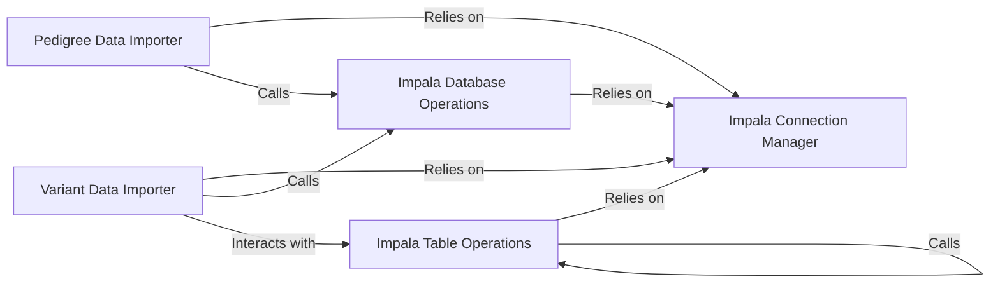

## Component Details

The ImpalaHelpers component serves as a comprehensive utility for interacting with Impala, providing functionalities ranging from connection management to complex data import and table and database operations. It centralizes common Impala tasks, making it a foundational layer for Impala-based data management within the project.

### Impala Connection Manager
This component is the core enabler for all Impala interactions. It is responsible for establishing and efficiently managing connections to the Impala database using a connection pool. This ensures optimal resource utilization and connection stability across various operations.

**Related Classes/Methods**:

- `ImpalaHelpers.__init__` (1:1)
- `ImpalaHelpers.connection` (1:1)
- `ImpalaHelpers.close` (1:1)

### Impala Database Operations
This component provides fundamental functionalities for managing Impala databases themselves. It allows for checking the existence of databases, creating new ones, and dropping existing databases.

**Related Classes/Methods**:

- `ImpalaHelpers.check_database` (1:1)
- `ImpalaHelpers.create_database` (1:1)
- `ImpalaHelpers.drop_database` (1:1)

### Impala Table Operations
This component offers a robust suite of utilities for comprehensive management of Impala tables. Its responsibilities include computing table statistics, collecting region bins, retrieving table creation statements, recreating, renaming, checking existence, and dropping tables. It also handles adding specific table properties related to partitioning.

**Related Classes/Methods**:

- `ImpalaHelpers.compute_table_stats` (1:1)
- `ImpalaHelpers.collect_region_bins` (1:1)
- `ImpalaHelpers.get_table_create_statement` (1:1)
- `ImpalaHelpers.recreate_table` (1:1)
- `ImpalaHelpers.rename_table` (1:1)
- `ImpalaHelpers.check_table` (1:1)
- `ImpalaHelpers.drop_table` (1:1)
- `ImpalaHelpers._add_partition_properties` (1:1)

### Pedigree Data Importer
This specialized component focuses on the task of importing pedigree data files into designated Impala tables. It orchestrates the creation of the necessary database and the external table structure specifically tailored for pedigree data.

**Related Classes/Methods**:

- `ImpalaHelpers.import_pedigree_into_db` (1:1)
- `ImpalaHelpers._import_single_file` (1:1)

### Variant Data Importer
This component handles the more complex process of importing variant data into Impala tables. It is responsible for constructing appropriate SQL statements for table creation, defining intricate schemas, applying partition properties, and managing the overall data loading process for variants.

**Related Classes/Methods**:

- `ImpalaHelpers.import_variants_into_db` (1:1)
- `ImpalaHelpers._build_variants_schema` (1:1)
- `ImpalaHelpers._build_import_variants_statement` (1:1)
- `ImpalaHelpers._build_impala_partitions` (1:1)

### [FAQ](https://github.com/CodeBoarding/GeneratedOnBoardings/tree/main?tab=readme-ov-file#faq)