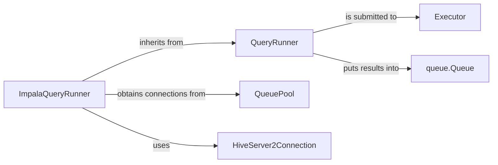

## Component Details

This overview focuses on the `ImpalaQueryRunner` component, a concrete implementation within the system designed for executing queries against Impala databases. It details its structure, purpose, and interactions with other fundamental components.

### QueryRunner
An abstract base class that establishes the foundational framework for all query execution within the system. It defines a common interface for managing the lifecycle of a query (started, closed, done), ensures thread safety using `threading.RLock`, and provides a `queue.Queue` for delivering results. It also supports a deserializer function to process fetched data.

**Related Classes/Methods**:

- `QueryRunner` (1:1)

### ImpalaQueryRunner
This component represents the concrete implementation of the `QueryRunner` abstract base class for Impala databases. There are two primary versions: one for Impala 1 (`impala_storage`) and another for Impala 2 (`impala2_storage`). Both versions share the core responsibility of connecting to an Impala instance via a connection pool, asynchronously executing SQL queries, and streaming the results back through the `QueryRunner`'s result queue after applying any specified deserialization. It includes robust logic for managing connection timeouts and handling execution status.

**Related Classes/Methods**:

- <a href="https://github.com/iossifovlab/gpf/blob/master/impala_storage/impala_storage/helpers/impala_query_runner.py#L16-L161" target="_blank" rel="noopener noreferrer">`impala_storage.helpers.impala_query_runner.ImpalaQueryRunner` (16:161)</a>
- <a href="https://github.com/iossifovlab/gpf/blob/master/impala2_storage/impala2_storage/helpers/impala_query_runner.py#L16-L161" target="_blank" rel="noopener noreferrer">`impala2_storage.helpers.impala_query_runner.ImpalaQueryRunner` (16:161)</a>

### QueuePool
A connection pooling mechanism (e.g., from `impala.dbapi.extras`) used by `ImpalaQueryRunner` to manage and provide efficient, reusable connections to the Impala database. This prevents the overhead of establishing a new connection for each query.

**Related Classes/Methods**: _None_

### HiveServer2Connection
Represents an active connection to an Impala HiveServer2 instance. `ImpalaQueryRunner` utilizes this connection to create cursors, execute SQL queries asynchronously, and retrieve the results.

**Related Classes/Methods**: _None_

### Executor
An abstract concept (e.g., an instance of `concurrent.futures.Executor`) that the `QueryRunner` uses to submit its `run` method for asynchronous execution. This allows queries to be processed in a separate thread or process, preventing the main application from blocking.

**Related Classes/Methods**: _None_

### queue.Queue
A thread-safe queue used by the `QueryRunner` (and consequently by `ImpalaQueryRunner`) to deliver processed query results (rows) to the consuming part of the application. It implements a backpressure mechanism, pausing the query execution if the consumer is unable to keep up with the data flow.

**Related Classes/Methods**: _None_

### [FAQ](https://github.com/CodeBoarding/GeneratedOnBoardings/tree/main?tab=readme-ov-file#faq)