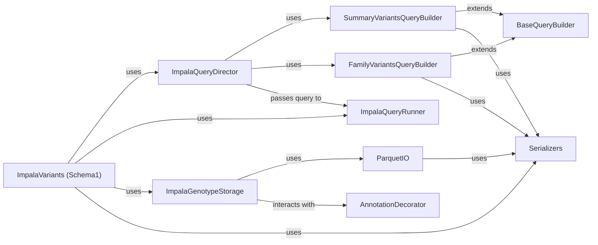

## Component Details

The ImpalaVariants (schema1) subsystem is designed to efficiently query and retrieve variant data from Impala databases that adhere to an older schema (schema1). Its core purpose is to abstract the complexities of Impala interactions, providing a streamlined interface for fetching genetic variant and pedigree information.

### ImpalaVariants (Schema1)
This is the primary interface and entry point for interacting with schema1 Impala variant data. It orchestrates the entire process of querying and retrieving variant information, making it the component users directly interact with.

**Related Classes/Methods**:

- `ImpalaVariants (Schema1)` (1:1)

### ImpalaQueryDirector
Crucial for managing the query building process, this component acts as a central coordinator. It determines which specific query builder (SummaryVariantsQueryBuilder or FamilyVariantsQueryBuilder) to use based on the request and directs the query execution. It's fundamental because it abstracts the complexity of query construction logic.

**Related Classes/Methods**:

- `ImpalaQueryDirector` (1:1)

### ImpalaQueryRunner
Responsible for the actual execution of SQL queries against the Impala database. Without this component, the constructed queries would not be able to retrieve data. It's fundamental as it's the direct interface to the database.

**Related Classes/Methods**:

- <a href="https://github.com/iossifovlab/gpf/blob/master/impala_storage/impala_storage/helpers/impala_query_runner.py#L16-L161" target="_blank" rel="noopener noreferrer">`ImpalaQueryRunner` (16:161)</a>

### SummaryVariantsQueryBuilder
Specifically designed to construct SQL queries for summary variants. It encapsulates the logic for building this specific type of query, which is a core function of the ImpalaVariants component.

**Related Classes/Methods**:

- <a href="https://github.com/iossifovlab/gpf/blob/master/impala_storage/impala_storage/schema1/summary_variants_query_builder.py#L18-L192" target="_blank" rel="noopener noreferrer">`SummaryVariantsQueryBuilder` (18:192)</a>

### FamilyVariantsQueryBuilder
Constructs SQL queries for family variants. Similar to SummaryVariantsQueryBuilder, it's fundamental for handling another core query type within the system.

**Related Classes/Methods**:

- <a href="https://github.com/iossifovlab/gpf/blob/master/impala_storage/impala_storage/schema1/family_variants_query_builder.py#L16-L236" target="_blank" rel="noopener noreferrer">`FamilyVariantsQueryBuilder` (16:236)</a>

### BaseQueryBuilder
This abstract component defines the common interface and shared functionalities for all query builders. It's fundamental because it promotes code reuse, consistency, and extensibility across different query types, ensuring a standardized approach to query construction.

**Related Classes/Methods**:

- <a href="https://github.com/iossifovlab/gpf/blob/master/impala_storage/impala_storage/schema1/base_query_builder.py#L23-L620" target="_blank" rel="noopener noreferrer">`BaseQueryBuilder` (23:620)</a>

### ImpalaGenotypeStorage
Handles the low-level interactions with the Impala storage system, including HDFS operations and data synchronization. It's fundamental because it manages the physical storage and retrieval of the genotype data that the queries operate on.

**Related Classes/Methods**:

- <a href="https://github.com/iossifovlab/gpf/blob/master/impala_storage/impala_storage/schema1/impala_genotype_storage.py#L28-L479" target="_blank" rel="noopener noreferrer">`ImpalaGenotypeStorage` (28:479)</a>

### ParquetIO
Impala uses Parquet files as its underlying data format. This component provides the necessary functionalities for reading from and writing to these files. It's fundamental because it's the direct interface for data serialization/deserialization to and from the storage format.

**Related Classes/Methods**:

- `ParquetIO` (1:1)

### Serializers
Responsible for converting Python objects to and from formats suitable for Impala queries and Parquet storage. It's fundamental because data needs to be correctly formatted for both querying and storage, and this component handles that crucial transformation.

**Related Classes/Methods**:

- <a href="https://github.com/iossifovlab/gpf/blob/master/wdae/wdae/groups_api/serializers.py#L1-L1" target="_blank" rel="noopener noreferrer">`Serializers` (1:1)</a>

### AnnotationDecorator
While not directly part of the core query execution, annotations are a critical aspect of variant data. This component is responsible for applying or handling annotations, which are often integrated into the data processing or query construction for variant analysis. It's fundamental for enriching or filtering variant data based on annotations.

**Related Classes/Methods**:

- <a href="https://github.com/iossifovlab/gpf/blob/master/impala_storage/impala_storage/schema1/annotation_decorator.py#L1-L1" target="_blank" rel="noopener noreferrer">`AnnotationDecorator` (1:1)</a>

### [FAQ](https://github.com/CodeBoarding/GeneratedOnBoardings/tree/main?tab=readme-ov-file#faq)