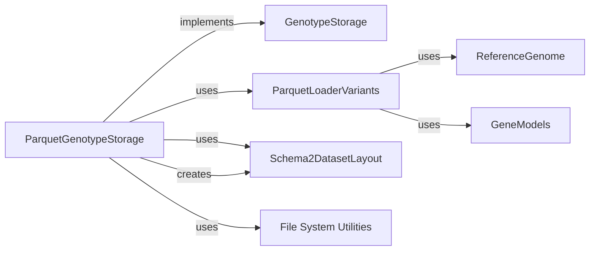

## Details

Bioinformatics Data Platform / Genomic Data Warehouse

### ParquetGenotypeStorage [[Expand]](./ParquetGenotypeStorage.md)
Manages and interacts with genotype data stored in Parquet files, implementing the GenotypeStorage interface.

**Related Classes/Methods**: _None_

### GenotypeStorage [[Expand]](./GenotypeStorage.md)
Interface for genotype storage solutions.

**Related Classes/Methods**: _None_

### ParquetLoaderVariants
Performs data loading and querying from Parquet files for genomic variant data.

**Related Classes/Methods**: _None_

### Schema2DatasetLayout
Ensures imported data conforms to a standardized Parquet schema and directory structure.

**Related Classes/Methods**: _None_

### File System Utilities
Provides basic file system operations for data management, such as copying files.

**Related Classes/Methods**: _None_

### ReferenceGenome
Represents a reference genome used for interpreting genomic data.

**Related Classes/Methods**: _None_

### GeneModels
Represents gene models used for interpreting genomic data.

**Related Classes/Methods**: _None_

### [FAQ](https://github.com/CodeBoarding/GeneratedOnBoardings/tree/main?tab=readme-ov-file#faq)