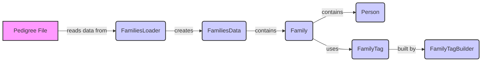

## Pedigree Loader Overview

The Pedigree Loader component is responsible for loading and managing pedigree data, which represents family relationships and individual attributes. It transforms raw data from pedigree files into a structured format suitable for variant analysis. The core components involved in this process are `FamiliesLoader`, `FamiliesData`, `FamilyTag`, `FamilyTagBuilder`, `Pedigree`, and `Person`.

### Component Descriptions

- **FamiliesLoader**:
  - *Description*: Loads families data from a pedigree file. It handles the parsing of the pedigree file format and transforms the raw data into a structured representation of families and individuals.
  - *Interaction*: Reads data from a pedigree file and creates a `FamiliesData` object.
  - *Source Files*: `dae/pedigrees/loader/FamiliesLoader.py`

- **FamiliesData**:
  - *Description*: Represents the loaded families data. It provides an interface for accessing and manipulating family and individual information and serves as the central data structure for pedigree analysis.
  - *Interaction*: Created by `FamiliesLoader` and contains `Family` objects. It is used to access and manipulate family and individual data.
  - *Source Files*: `dae/pedigrees/families_data/FamiliesData.py`

- **Family**:
  - *Description*: Represents the pedigree information for a single family, including individuals and their relationships. It encapsulates the data and logic for managing family relationships.
  - *Interaction*: Contained within `FamiliesData` and contains `Person` objects. It manages the relationships between individuals in a family.
  - *Source Files*: `dae/pedigrees/family.py`

- **Person**:
  - *Description*: Represents an individual within a pedigree, including their attributes and relationships to other family members. It encapsulates individual-level data and provides methods for accessing and manipulating this data.
  - *Interaction*: Contained within `Family` and represents an individual. It stores individual-level data and provides access to it.
  - *Source Files*: `dae/pedigrees/family.py`, `dae/pedigrees/person.py`

- **FamilyTag**:
  - *Description*: Represents a tag associated with a family. These tags can be used to categorize and filter families based on specific criteria, enabling targeted analysis.
  - *Interaction*: Used by `Family` to categorize families. Tags are built by `FamilyTagBuilder`.
  - *Source Files*: `dae/pedigrees/family.py`

- **FamilyTagBuilder**:
  - *Description*: Builds and checks family tags based on a query. It allows for the dynamic creation and validation of family tags based on complex criteria, enabling flexible family categorization.
  - *Interaction*: Builds `FamilyTag` objects and associates them with `Family` objects.
  - *Source Files*: `dae/pedigrees/family_tag_builder.py`