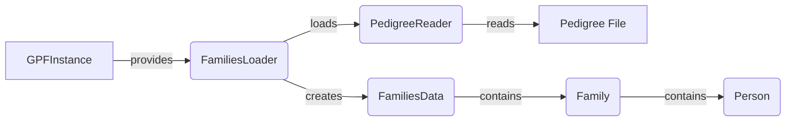

```markdown
## Pedigree Loader Overview

This document provides an overview of the Pedigree Loader component, which is responsible for loading and managing pedigree data. The pedigree data represents family relationships and individual attributes, and the loader transforms raw data into a structured format suitable for variant analysis.

### Data Flow Diagram

