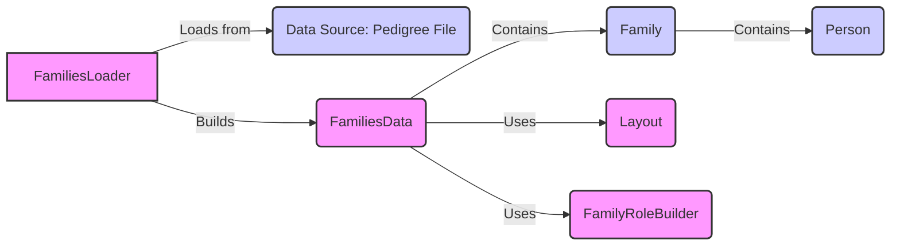

## Pedigree Management Component Overview

This component focuses on loading, representing, and manipulating pedigree data to provide family relationships and individual characteristics. It's crucial for family-based analysis and variant filtering.

### Data Flow Diagram

### Component Descriptions

#### 1. FamiliesLoader

*   **Description**: Responsible for loading family pedigree data from various sources like pedigree files or simple family files. It then builds a `FamiliesData` object.
*   **Functionality**: Reads pedigree information from files, parses the data, and constructs a structured representation of families and individuals.
*   **Interaction**: Loads data from a data source (e.g., a pedigree file) and builds a `FamiliesData` object, passing the loaded data to it.
*   **Source Files**: `dae/pedigrees/loader.py`

#### 2. Data Source: Pedigree File

*   **Description**: Represents the external source of pedigree information, typically a file in a specific format (e.g., PED, TSV).
*   **Functionality**: Stores the raw data representing families and individuals, including their relationships and attributes.
*   **Interaction**: Provides the raw data that `FamiliesLoader` reads and parses.
*   **Source Files**: N/A (external data source)

#### 3. FamiliesData

*   **Description**: Represents a collection of families, providing methods for accessing and manipulating family data. It encapsulates the pedigree information in a structured format.
*   **Functionality**: Stores and manages a collection of `Family` objects. Provides methods to access families by ID, iterate through families, and build data frames representing the pedigree.
*   **Interaction**: Receives data from `FamiliesLoader` and stores it in a structured format. Uses `Family`, `Person`, `Layout`, and `FamilyRoleBuilder` to organize and enhance the data.
*   **Source Files**: `dae/pedigrees/families_data.py`

#### 4. Family

*   **Description**: Represents a single family within the pedigree. It contains information about the individuals in the family and their relationships.
*   **Functionality**: Stores a collection of `Person` objects representing the members of a family. Provides methods to access family members, determine relationships, and represent the family as a data frame.
*   **Interaction**: Contained within `FamiliesData`. Holds `Person` objects and provides methods for accessing and manipulating family member data.
*   **Source Files**: `dae/pedigrees/family.py`

#### 5. Person

*   **Description**: Represents an individual within a family. It stores attributes such as ID, sex, status, and role.
*   **Functionality**: Stores individual attributes like ID, sex, status, and role. Provides methods to access and modify these attributes.
*   **Interaction**: Contained within `Family`. Represents an individual within a family and stores their attributes.
*   **Source Files**: `dae/pedigrees/family.py`

#### 6. Layout

*   **Description**: Handles the layout and visualization of family pedigrees. It generates or loads layout information for families.
*   **Functionality**: Generates or loads layout information for families, determining the position of individuals in a pedigree visualization.
*   **Interaction**: Used by `FamiliesData` to generate layouts for families, which are then stored as attributes of `Person` objects.
*   **Source Files**: `dae/pedigrees/layout.py`

#### 7. FamilyRoleBuilder

*   **Description**: Builds and assigns roles to individuals within a family when the role information is missing from the input data.
*   **Functionality**: Analyzes family relationships and assigns roles (e.g., proband, sibling, parent) to individuals based on their position in the family.
*   **Interaction**: Used by `FamiliesData` to assign roles to individuals within families, enhancing the pedigree data with role information.
*   **Source Files**: `dae/pedigrees/family_role_builder.py`