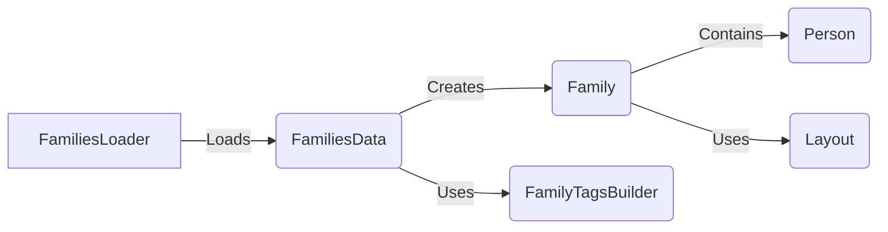

## Pedigree Management Overview

This overview describes the flow of data and interactions between key components involved in pedigree management within the `dae.pedigrees` subsystem. The core functionality revolves around loading, representing, and manipulating pedigree data to facilitate family structure analysis.

## Component Descriptions

**1. FamiliesLoader**

*   **Description:** Responsible for loading family data from various file formats (e.g., pedigree files, simple families files). It parses the data and structures it into a `FamiliesData` object.
*   **Interaction:** Loads data from files and creates a `FamiliesData` object.
*   **Relevant source files:** `dae/pedigrees/loader.py`

**2. FamiliesData**

*   **Description:** Represents a collection of families. It provides functionalities to access and query family structures. It is constructed from pedigree dataframes or a list of family persons.
*   **Interaction:** Receives data from `FamiliesLoader` and creates `Family` objects. Uses `FamilyTagsBuilder` to tag families.
*   **Relevant source files:** `dae/pedigrees/families_data.py`

**3. Family**

*   **Description:** Represents a single family, including its members and their relationships. It provides methods to connect family members, determine parent-child relationships, and check for the presence of both parents.
*   **Interaction:** Created by `FamiliesData`. Contains `Person` objects and uses `Layout` to manage visual representation.
*   **Relevant source files:** `dae/pedigrees/family.py`

**4. Person**

*   **Description:** Represents an individual within a family, storing information about their attributes and relationships.
*   **Interaction:** Contained within a `Family` object.
*   **Relevant source files:** `dae/pedigrees/family.py`

**5. Layout**

*   **Description:** Represents the layout of a family pedigree, providing functionalities to arrange family members in a visual representation. It can be generated from a family and applied to a family.
*   **Interaction:** Used by `Family` to manage the visual layout of family members.
*   **Relevant source files:** `dae/pedigrees/layout.py`

**6. FamilyTagsBuilder**

*   **Description:** Builds tags for families based on specific criteria or characteristics. It provides methods to tag families based on their properties.
*   **Interaction:** Used by `FamiliesData` to tag families based on their properties.
*   **Relevant source files:** `dae/pedigrees/family_tag_builder.py`