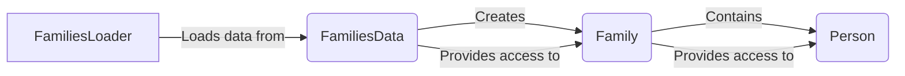

## Pedigree Management Component Overview

This document provides a high-level overview of the Pedigree Management component, which is responsible for loading, representing, and manipulating pedigree data. The component uses the classes `FamiliesLoader`, `FamiliesData`, `Family`, and `Person` to represent pedigree information.

### Data Flow Diagram

### Component Descriptions

*   **FamiliesLoader**
    *   **Description**: Loads families data from a file or other data source. It parses the input data and creates `Family` and `Person` objects.
    *   **Interaction**: Reads pedigree data from a file and uses it to construct a `FamiliesData` object.
    *   **Source Files**: `dae/pedigrees/loader.py`
*   **FamiliesData**
    *   **Description**: Represents a collection of `Family` objects. It provides methods to access and query families within the collection.
    *   **Interaction**: Receives data from `FamiliesLoader` and organizes it into `Family` objects. Provides access to individual families and persons.
    *   **Source Files**: `dae/pedigrees/families_data.py`
*   **Family**
    *   **Description**: Represents a single family, containing a collection of `Person` objects and their relationships. It provides methods to query family relationships (e.g., parent-child).
    *   **Interaction**: Created by `FamiliesData` and contains `Person` objects. Provides methods to determine relationships between family members.
    *   **Source Files**: `dae/pedigrees/family.py`
*   **Person**
    *   **Description**: Represents an individual within a family. It stores attributes of the person, such as role, sex, and status, and provides access to these attributes.
    *   **Interaction**: Created by `FamiliesLoader` and contained within a `Family` object. Stores individual attributes and provides access to them.
    *   **Source Files**: `dae/pedigrees/family.py`, `dae/variants/attributes.py`
