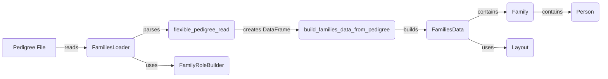

## Pedigree Management Overview

This overview describes the flow of data and interactions between key components involved in loading, representing, and manipulating pedigree data within the `dae.pedigrees` subsystem. The diagram illustrates how pedigree files are read, parsed, and transformed into a structured representation suitable for family-based analysis and variant filtering.

### Component Descriptions

*   **FamiliesLoader**
    *   **Description:** Loads pedigree data from a file and creates a `FamiliesData` object. It handles different file formats and parameters for parsing the pedigree information.
    *   **Interaction:** Reads pedigree files, uses `flexible_pedigree_read` to parse the file content, and then uses `build_families_data_from_pedigree` to create the `FamiliesData` object. It also uses `FamilyRoleBuilder` to build family roles when they are not provided in the pedigree file.
    *   **Relevant source files:** `dae/pedigrees/loader.py`

*   **flexible_pedigree_read**
    *   **Description:** Reads a pedigree file in a flexible format, handling different separators, column names, and data types. It uses `pandas.read_csv` to parse the file and returns a DataFrame.
    *   **Interaction:** Called by `FamiliesLoader` to parse the pedigree file. It returns a Pandas DataFrame that represents the pedigree data.
    *   **Relevant source files:** `dae/pedigrees/loader.py`

*   **build_families_data_from_pedigree**
    *   **Description:** Builds a `FamiliesData` object from a Pandas DataFrame. It sets pedigree parameters, builds family layouts, roles, and tags.
    *   **Interaction:** Called by `FamiliesLoader` to create the `FamiliesData` object from the DataFrame. It populates the `FamiliesData` object with family and person information.
    *   **Relevant source files:** `dae/pedigrees/loader.py`

*   **FamiliesData**
    *   **Description:** Represents the loaded pedigree data, holding information about families and individuals. It provides methods for accessing and manipulating family and person data.
    *   **Interaction:** Created by `FamiliesLoader` and contains `Family` objects. It uses `Layout` to generate or load layout information for families.
    *   **Relevant source files:** `dae/pedigrees/families_data.py`

*   **Family**
    *   **Description:** Represents a family unit, containing a collection of `Person` objects and methods for accessing family relationships.
    *   **Interaction:** Contained within `FamiliesData` and contains `Person` objects. It provides methods for accessing family relationships.
    *   **Relevant source files:** `dae/pedigrees/family.py`

*   **Person**
    *   **Description:** Represents an individual in a family, with attributes like ID, sex, status, and role. It stores individual-specific information and provides methods for accessing and manipulating these attributes.
    *   **Interaction:** Contained within `Family` objects. It stores individual-specific information.
    *   **Relevant source files:** `dae/pedigrees/family.py`

*   **FamilyRoleBuilder**
    *   **Description:** Builds family roles when they are not provided in the pedigree file. It analyzes the family structure and assigns roles based on relationships and status.
    *   **Interaction:** Used by `FamiliesLoader` to build family roles when they are not provided in the pedigree file.
    *   **Relevant source files:** `dae/pedigrees/family_role_builder.py`

*   **Layout**
    *   **Description:** Generates or loads layout information for families. It is used to visualize the pedigree structure and arrange individuals in a meaningful way.
    *   **Interaction:** Used by `FamiliesData` to generate or load layout information for families.
    *   **Relevant source files:** `dae/pedigrees/layout.py`
