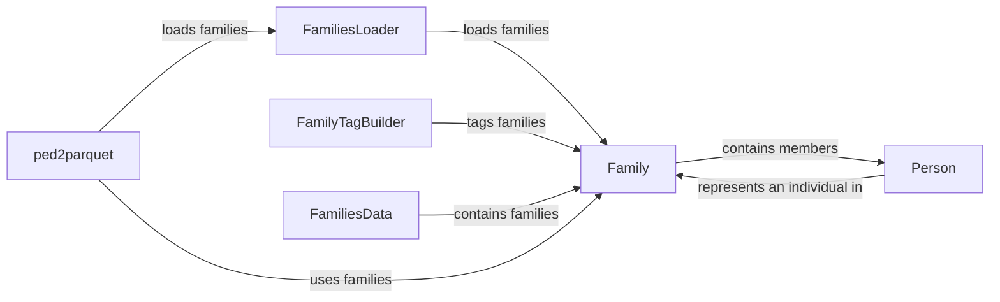

## Component Details

### FamiliesLoader
The FamiliesLoader component is responsible for loading pedigree data from various file formats and sources. It parses command-line arguments, reads pedigree files, and creates Family objects. This component acts as the entry point for pedigree data, providing a consistent interface for loading family structures into the system.
- **Related Classes/Methods**: `dae.pedigrees.loader.FamiliesLoader`

### Family
The Family component represents a single family within the pedigree data. It stores information about family members (Person objects) and their relationships. It provides methods for accessing and manipulating family data, including adding members, connecting individuals, and managing family-level tags. The Family component is a central data structure for representing family relationships.
- **Related Classes/Methods**: `dae.pedigrees.family.Family`

### Person
The Person component represents an individual within a family. It stores attributes such as sex, role, and status. It provides methods for accessing and modifying person-specific data and for setting and unsetting family tags. Each Person object belongs to a Family object, representing their membership in that family.
- **Related Classes/Methods**: `dae.pedigrees.family.Person`

### FamilyTagBuilder
The FamilyTagBuilder component is responsible for automatically tagging families based on their structure and properties. It analyzes family compositions (e.g., nuclear, quad, trio) and applies appropriate tags to Family objects. This component helps categorize families based on their characteristics, enabling downstream analysis and filtering.
- **Related Classes/Methods**: `dae.pedigrees.family_tag_builder`

### FamiliesData
The FamiliesData component represents a collection of Family objects. It provides a container for managing multiple families and offers methods for accessing and iterating over the families in the dataset. This component serves as a higher-level abstraction for working with pedigree data, allowing for operations on sets of families.
- **Related Classes/Methods**: `dae.pedigrees.families_data.FamiliesData`

### ped2parquet
The ped2parquet component is a tool for converting pedigree data into the Parquet format. It utilizes the FamiliesLoader to load pedigree data and then writes the data to Parquet files. This component facilitates the storage and retrieval of pedigree data in an efficient and columnar format.
- **Related Classes/Methods**: `repos.gpf.impala_storage.impala_storage.tools.ped2parquet`
