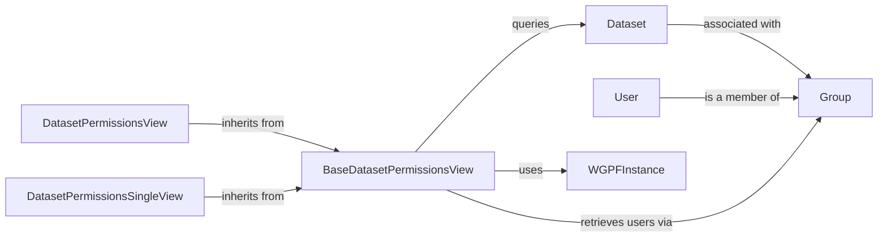

## Component Details

Overview of the Permissions subsystem

### Dataset
The core Django ORM model representing a dataset within the WDAE application. It stores essential metadata like `dataset_id`, `dataset_name`, and a `broken` status. Crucially, it defines the many-to-many relationship with `Group`s, which is the foundation for access control. It provides methods to manage its state and associate with default permission groups.

**Related Classes/Methods**:

- `Dataset` (1:1)

### Group
The standard Django ORM model for user groups. In this subsystem, `Group`s are directly linked to `Dataset`s, and users gain access to datasets by being members of these groups. It acts as an intermediary for defining access policies.

**Related Classes/Methods**:

- `django.contrib.auth.models.Group` (1:1)

### User
The standard Django ORM model representing individual users in the system. Users are associated with `Group`s, and through these groups, their access rights to specific datasets are determined.

**Related Classes/Methods**:

- `django.contrib.auth.models.User` (1:1)

### WGPFInstance
A singleton class that serves as the primary interface to the underlying GPF (Genomic Variant Frequency) instance. It manages and provides access to GPF study data (wrapped as `WDAEStudy` or `WDAEStudyGroup` objects). In the context of permissions, it's vital for retrieving the actual study metadata and determining which datasets are configured as "visible" within the application.

**Related Classes/Methods**:

- `WGPFInstance` (1:1)

### BaseDatasetPermissionsView
An abstract base class for API views that provides common logic for retrieving and formatting detailed information about a single dataset, including its associated user groups and individual users. It integrates with the `Dataset` model and `WGPFInstance` to gather comprehensive permission-related data.

**Related Classes/Methods**:

- `BaseDatasetPermissionsView` (1:1)

### DatasetPermissionsView
A concrete API view responsible for handling requests to retrieve a paginated list of dataset permissions. It supports searching by dataset name and leverages `BaseDatasetPermissionsView` to format individual dataset details. It also enforces staff-level access, ensuring only authorized personnel can view the full list of permissions.

**Related Classes/Methods**:

- `DatasetPermissionsView` (1:1)

### DatasetPermissionsSingleView
A concrete API view designed to retrieve permission details for a specific dataset, identified by its ID. It utilizes the `_get_dataset_info` method from `BaseDatasetPermissionsView` to fetch and format the dataset's comprehensive permission information.

**Related Classes/Methods**:

- `DatasetPermissionsSingleView` (1:1)

### [FAQ](https://github.com/CodeBoarding/GeneratedOnBoardings/tree/main?tab=readme-ov-file#faq)