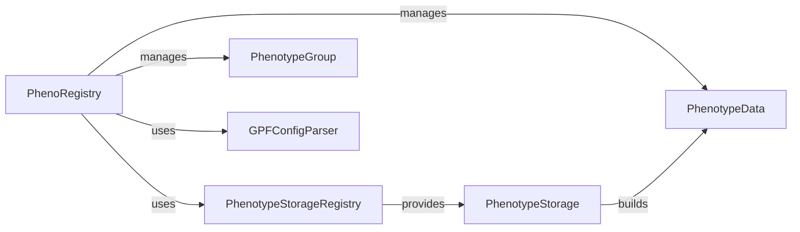

## Component Details

This system manages and provides access to phenotype datasets, orchestrating loading, caching, and retrieval through a central registry and various storage mechanisms.

### PhenoRegistry
The core component of this subsystem. It manages the lifecycle of `PhenotypeData` objects, including loading, caching, and providing access to them. It ensures that phenotype data is loaded efficiently and consistently.

**Related Classes/Methods**:

- `PhenoRegistry` (0:0)

### PhenotypeStorageRegistry
This component is responsible for managing and providing access to different `PhenotypeStorage` implementations. It acts as a factory for obtaining the correct storage mechanism based on configuration.

**Related Classes/Methods**:

- `PhenotypeStorageRegistry` (0:0)

### PhenotypeData
An abstract representation of a phenotype dataset. This could be a single phenotype study or a group of studies. It provides an interface for accessing phenotype-related information.

**Related Classes/Methods**:

- <a href="https://github.com/iossifovlab/gpf/blob/master/dae/dae/configuration/schemas/phenotype_data.py#L0-L0" target="_blank" rel="noopener noreferrer">`PhenotypeData` (0:0)</a>

### PhenotypeGroup
A concrete implementation of `PhenotypeData` that represents a collection of multiple phenotype studies. It aggregates data from its child studies.

**Related Classes/Methods**:

- `PhenotypeGroup` (0:0)

### GPFConfigParser
A utility component responsible for parsing configuration files, specifically for phenotype data. It helps in loading the necessary configurations for phenotype studies.

**Related Classes/Methods**:

- `GPFConfigParser` (0:0)

### PhenotypeStorage
An abstract component representing a mechanism for storing and retrieving phenotype data.

**Related Classes/Methods**:

- `PhenotypeStorage` (0:0)

### [FAQ](https://github.com/CodeBoarding/GeneratedOnBoardings/tree/main?tab=readme-ov-file#faq)