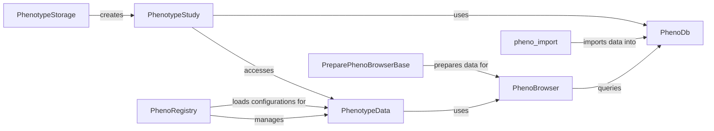

## Component Details

The Phenotype Data Management component is responsible for importing, storing, managing, and analyzing phenotype data within the system. It facilitates the integration of phenotype data with genomic data, enabling comprehensive analysis and exploration of phenotypic traits. The core flow involves importing data using `pheno_import`, storing it in a database managed by `PhenoDb`, and then using `PhenotypeStudy` and `PhenotypeData` to access and analyze the data. `PhenoBrowser` provides a user interface for exploring the data, while `PhenoRegistry` manages the configuration and retrieval of phenotype data. `PhenotypeStorage` handles the underlying storage infrastructure, and `PreparePhenoBrowserBase` prepares the data for the browser.

### PhenotypeStudy
Represents a phenotype study, encapsulating all phenotype data and metadata associated with a specific study. It handles loading instruments, managing person set collections, and providing access to phenotype measures and related data.
- **Related Classes/Methods**: `gpf.dae.dae.pheno.pheno_data.PhenotypeStudy`

### PhenotypeData
Represents the phenotype data itself, providing methods for accessing and querying the data. It handles building the pheno browser, retrieving person data, searching measures, and building reports.
- **Related Classes/Methods**: `gpf.dae.dae.pheno.pheno_data.PhenotypeData`

### PhenoBrowser
Provides an interface for browsing and exploring phenotype data. It handles creating browser tables, saving regression results, searching measures, and counting measures.
- **Related Classes/Methods**: `gpf.dae.dae.pheno.browser.PhenoBrowser`

### PhenoDb
Manages the database connection and provides methods for querying the phenotype data stored in the database. It handles retrieving pedigree data, person data, measure data, and saving descriptions.
- **Related Classes/Methods**: `gpf.dae.dae.pheno.db.PhenoDb`

### PhenotypeStorage
Handles the storage configuration and building of phenotype studies. It is responsible for creating and managing the underlying storage infrastructure for phenotype data.
- **Related Classes/Methods**: `gpf.dae.dae.pheno.storage.PhenotypeStorage`

### PhenoRegistry
Manages the registration and retrieval of phenotype data configurations. It loads configurations, retrieves phenotype data, and caches loaded data for efficient access.
- **Related Classes/Methods**: `gpf.dae.dae.pheno.registry.PhenoRegistry`

### pheno_import
This module contains the main functions for importing phenotype data into the system. It handles parsing command-line arguments, reading data from files, inferring measure types, creating database tables, and writing the imported data to the database.
- **Related Classes/Methods**: `gpf.dae.dae.pheno.pheno_import`

### PreparePhenoBrowserBase
This class provides a base for preparing data for the PhenoBrowser. It includes methods for building regression models, creating visualizations, and adding measure build tasks.
- **Related Classes/Methods**: `gpf.dae.dae.pheno.prepare_data.PreparePhenoBrowserBase`
